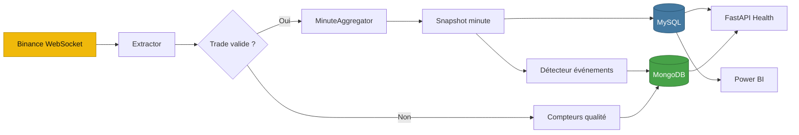
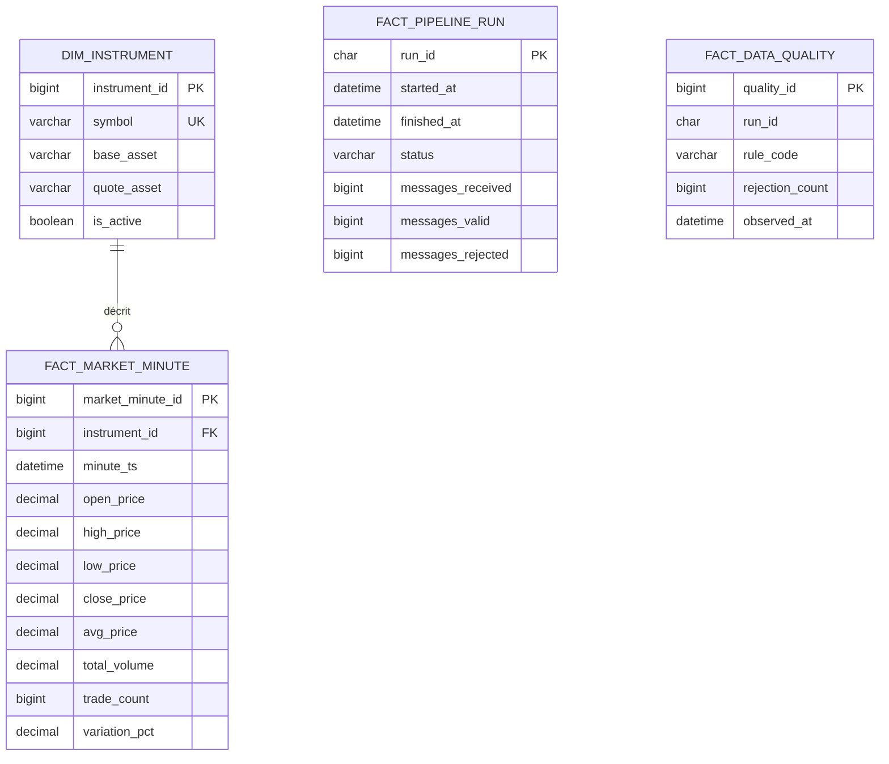
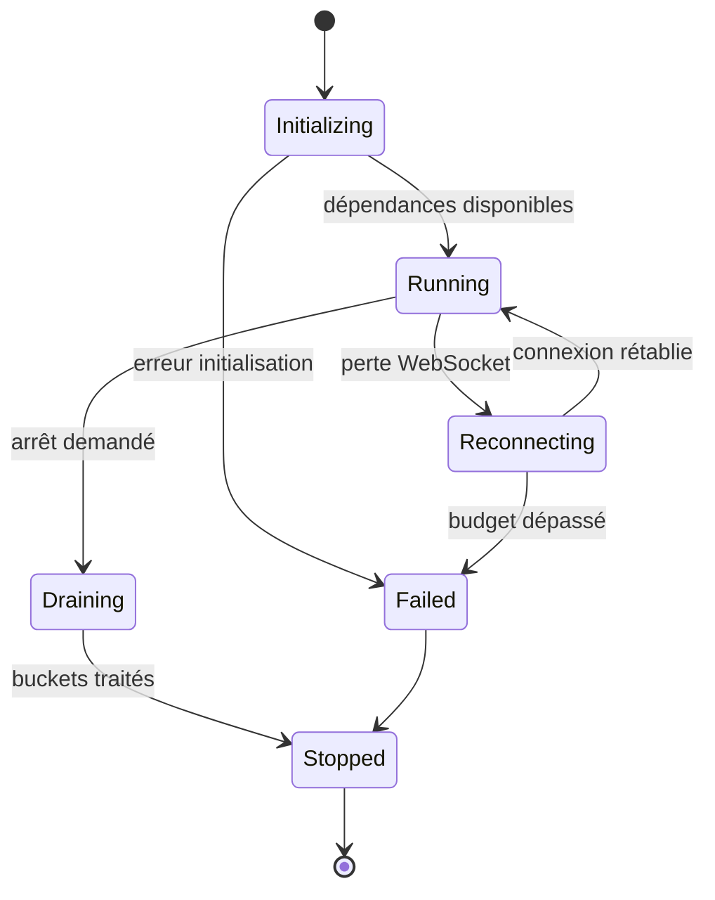
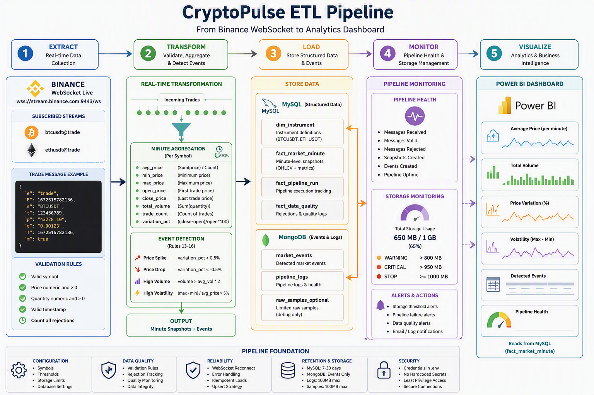

<div align="center">
# ₿ CryptoPulse ETL
### Pipeline de données temps réel pour les marchés crypto
[](https://www.python.org/)
[](https://fastapi.tiangolo.com/)
[](https://www.mysql.com/)
[](https://www.mongodb.com/)
[](https://powerbi.microsoft.com/)
[](https://github.com/amine-LabsCraft)
[](https://amine-aitali-5752.netlify.app/)
**Extraction WebSocket · Agrégation OHLCV · Stockage hybride · Détection d’événements · Business Intelligence**
</div>
> [!IMPORTANT]
> CryptoPulse ETL est un projet pédagogique de Data Engineering. Il ne constitue pas un système de trading, un conseil financier ou une garantie de disponibilité des données.
> [!NOTE]
> Cette documentation décrit une architecture de référence. Certains éléments, comme la rétention automatisée, les métriques Prometheus, Docker Compose ou les endpoints avancés, sont présentés comme recommandations d’industrialisation et doivent être implémentés s’ils ne figurent pas encore dans le code source.
## Table des matières
1. [Présentation générale](#1-presentation-generale)
2. [Objectifs et périmètre](#2-objectifs-et-perimetre)
3. [Fonctionnalités](#3-fonctionnalites)
4. [Architecture globale](#4-architecture-globale)
5. [Principes de conception](#5-principes-de-conception)
6. [Structure du dépôt](#6-structure-du-depôt)
7. [Flux de données de bout en bout](#7-flux-de-donnees-de-bout-en-bout)
8. [Prérequis](#8-prerequis)
9. [Installation locale sous Windows](#9-installation-locale-sous-windows)
10. [Installation sous Linux](#10-installation-sous-linux)
11. [Configuration](#11-configuration)
12. [Gestion des secrets](#12-gestion-des-secrets)
13. [Initialisation de MySQL](#13-initialisation-de-mysql)
14. [Initialisation de MongoDB](#14-initialisation-de-mongodb)
15. [Extraction depuis Binance](#15-extraction-depuis-binance)
16. [Validation et qualité des données](#16-validation-et-qualite-des-donnees)
17. [Transformation minute par minute](#17-transformation-minute-par-minute)
18. [Modèle de données MySQL](#18-modele-de-donnees-mysql)
19. [Modèle documentaire MongoDB](#19-modele-documentaire-mongodb)
20. [Détection des événements](#20-detection-des-evenements)
21. [Orchestration du pipeline](#21-orchestration-du-pipeline)
22. [API FastAPI](#22-api-fastapi)
23. [Exécution du projet](#23-execution-du-projet)
24. [Tests et stratégie qualité](#24-tests-et-strategie-qualite)
25. [Observabilité et journalisation](#25-observabilite-et-journalisation)
26. [Gestion du stockage et rétention](#26-gestion-du-stockage-et-retention)
27. [Intégration Power BI](#27-integration-power-bi)
28. [Sécurité](#28-securite)
29. [Performances et capacité](#29-performances-et-capacite)
30. [Résilience et reprise](#30-resilience-et-reprise)
31. [Déploiement Docker](#31-deploiement-docker)
32. [Déploiement systemd](#32-deploiement-systemd)
33. [CI/CD GitHub Actions](#33-cicd-github-actions)
34. [Dépannage](#34-depannage)
35. [Guide de développement](#35-guide-de-developpement)
36. [Roadmap](#36-roadmap)
37. [FAQ](#37-faq)
38. [Glossaire](#38-glossaire)
39. [Runbooks opérationnels](#39-runbooks-operationnels)
40. [Annexes](#40-annexes)
41. [Auteur et contribution](#41-auteur-et-contribution)
42. [Licence](#42-licence)
## 1. Présentation générale
**CryptoPulse ETL** est une chaîne de traitement de données temps réel conçue pour recevoir des transactions de marché depuis le WebSocket public de Binance, contrôler leur validité, former des agrégats analytiques par minute, détecter des comportements remarquables et exposer des données stables à Power BI.
Le projet sépare volontairement les responsabilités :
- **MySQL** conserve les faits analytiques structurés et les dimensions.
- **MongoDB** conserve les événements de marché et les journaux opérationnels.
- **FastAPI** fournit des points de contrôle simples pour la santé du service.
- **Power BI** interroge la couche persistée sans dépendre du flux WebSocket.
- **Python asynchrone** gère l’ingestion et réduit le blocage lors des entrées-sorties.
### 1.1 Proposition de valeur
- Passer d’un flux événementiel à haute fréquence à un modèle analytique compact.
- Réduire fortement le volume stocké grâce à l’agrégation minute.
- Préserver les données utiles aux analyses sans conserver chaque transaction brute.
- Observer la qualité, les rejets, les interruptions et l’occupation disque.
- Fournir une base claire pour apprendre les concepts ETL, SQL, NoSQL, API et BI.
### 1.2 Résumé du chemin critique
```text
Binance WebSocket
        │
        ▼
Extracteur asynchrone
        │
        ▼
Validation des messages
        │
        ├── rejet + compteur de qualité
        │
        ▼
Agrégateur par symbole et minute
        │
        ├── snapshot OHLCV ─────────────► MySQL
        │
        └── événement significatif ─────► MongoDB
                                             │
                                             ▼
                                      Supervision / analyse

MySQL ─────────────────────────────────────► Power BI
```
## 2. Objectifs et périmètre
### 2.1 Objectifs fonctionnels
- Ingestérer en direct les transactions de `BTCUSDT` et `ETHUSDT`.
- Valider le symbole, le prix, la quantité et l’horodatage.
- Calculer un snapshot par symbole pour chaque minute complète.
- Persister des métriques cohérentes et interrogeables dans MySQL.
- Identifier les variations, volumes et amplitudes inhabituels.
- Conserver uniquement les événements importants dans MongoDB.
- Présenter les tendances dans un tableau de bord Power BI.
- Surveiller la limite globale de stockage de 1 000 MB.
### 2.2 Hors périmètre
- Passage d’ordres, exécution de stratégies ou connexion à un compte privé.
- Conseil financier, prédiction garantie ou automatisation de portefeuille.
- Archivage exhaustif et permanent de chaque transaction brute.
- Haute disponibilité multi-région prête pour une production critique.
- Remplacement d’une plateforme spécialisée de streaming distribuée.
- Utilisation directe du WebSocket par Power BI.
### 2.3 Hypothèses
1. La machine dispose d’une connexion Internet stable.
2. Les horloges du système sont synchronisées.
3. MySQL et MongoDB sont disponibles localement ou sur un réseau accessible.
4. Les données de marché sont reçues en UTC.
5. Les symboles sont normalisés avant stockage.
6. Les secrets ne sont jamais validés dans Git.
7. Une minute est considérée fermée lorsque le pipeline passe au bucket suivant.
8. Les données tardives font l’objet d’une règle explicite.
9. Le projet reste limité à deux symboles dans sa configuration initiale.
10. Les seuils doivent être adaptés au contexte de marché.
## 3. Fonctionnalités
| Fonctionnalité | Description |
|---|---|
| **Ingestion temps réel** | Connexion WebSocket et lecture continue des transactions. |
| **Filtrage** | Restriction aux symboles explicitement autorisés. |
| **Validation** | Contrôle de présence, de type, de positivité et de date. |
| **Agrégation** | Calcul de prix moyen, OHLC, volume, nombre et variation. |
| **Idempotence** | Contrainte unique par instrument et minute. |
| **Événements** | Détection de hausse, baisse, volume et volatilité. |
| **Stockage hybride** | MySQL pour l’analytique, MongoDB pour les événements. |
| **Santé** | Endpoints FastAPI et journaux de pipeline. |
| **Qualité** | Comptage des messages valides, invalides et rejetés. |
| **BI** | Modèle conçu pour une consommation stable depuis Power BI. |
| **Maîtrise du volume** | Seuils d’alerte et stratégie de rétention. |
| **Extensibilité** | Ajout possible de symboles, métriques et événements. |
## 4. Architecture globale
### 4.1 Diagramme Mermaid

### 4.2 Vue par couches
#### Source
Binance diffuse des transactions de marché publiques.
#### Ingestion
Le client asynchrone reçoit et décode les messages JSON.
#### Qualité
Les champs obligatoires sont contrôlés avant tout calcul.
#### Transformation
Les transactions sont regroupées par symbole et minute UTC.
#### Détection
Des règles dérivées produisent des événements rares et explicables.
#### Persistance
Les faits vont dans MySQL; les événements et logs vont dans MongoDB.
#### Présentation
Power BI construit des indicateurs à partir de tables stables.
#### Exploitation
FastAPI, logs et runbooks facilitent le diagnostic.


## 5. Principes de conception
### 5.1 Simplicité avant distribution
Le projet évite Spark, Airflow et Snowflake tant que le volume ne les justifie pas.
### 5.2 Données brutes éphémères
Les trades existent en mémoire pendant la construction du bucket, mais ne sont pas archivés durablement.
### 5.3 Persisted truth
La couche de présentation lit la base, jamais la source temps réel directement.
### 5.4 Idempotence
Une même minute ne doit pas créer plusieurs faits pour un symbole.
### 5.5 UTC partout
Les horodatages sont normalisés afin d’éviter les ambiguïtés de fuseau.
### 5.6 Configuration externe
Les valeurs variables et secrets sont séparés du code.
### 5.7 Dégradation contrôlée
Une base indisponible doit générer une erreur observable, pas une perte silencieuse.
### 5.8 Budget de stockage
Chaque famille de données possède une cible de volume et de rétention.
### 5.9 Observabilité
Chaque exécution laisse des métriques permettant d’expliquer son résultat.
### 5.10 Testabilité
Les transformations sont déterministes et testables sans WebSocket réel.
## 6. Structure du dépôt
```text
CryptoPulse-ETL/
├── app/
│   ├── __init__.py
│   ├── main.py
│   ├── pipeline.py
│   ├── extractor.py
│   ├── transformer.py
│   ├── loaders.py
│   └── mongo_loader.py
├── config/
│   ├── __init__.py
│   └── settings.py
├── tests/
│   ├── __init__.py
│   └── test_pipeline.py
├── .env.example
├── .gitignore
├── requirements.txt
├── Dockerfile
├── docker-compose.yml
├── LICENSE
└── README.md
```
| Chemin | Responsabilité |
|---|---|
| `app/main.py` | Crée l’application FastAPI et expose les endpoints de santé. |
| `app/pipeline.py` | Coordonne l’extracteur, le transformateur et les deux loaders. |
| `app/extractor.py` | Gère la connexion, la souscription, la validation et la reconnexion. |
| `app/transformer.py` | Maintient les buckets minute et calcule les snapshots. |
| `app/loaders.py` | Initialise et alimente les tables MySQL. |
| `app/mongo_loader.py` | Initialise et alimente les collections MongoDB. |
| `config/settings.py` | Centralise les réglages et valeurs par défaut. |
| `tests/test_pipeline.py` | Valide les unités et les intégrations disponibles. |
| `.env.example` | Documente les variables attendues sans exposer de secret. |
| `requirements.txt` | Fige ou borne les dépendances Python. |
## 7. Flux de données de bout en bout
### 7.1 Connexion
Ouverture de la session WebSocket.
### 7.2 Souscription
Demande des flux `btcusdt@trade` et `ethusdt@trade`.
### 7.3 Réception
Lecture d’un message JSON.
### 7.4 Décodage
Conversion vers une structure Python.
### 7.5 Validation du symbole
Rejet si le symbole n’est pas autorisé.
### 7.6 Validation du prix
Conversion en décimal et contrôle strictement positif.
### 7.7 Validation de la quantité
Conversion et contrôle strictement positif.
### 7.8 Validation temporelle
Conversion de l’époque milliseconde vers UTC.
### 7.9 Normalisation
Mise en forme interne stable.
### 7.10 Affectation
Calcul de la clé de minute.
### 7.11 Accumulation
Mise à jour du premier, dernier, minimum, maximum, somme et compteur.
### 7.12 Fermeture
Finalisation du bucket lorsque la minute change.
### 7.13 Enrichissement
Calcul des variations et indicateurs.
### 7.14 Chargement SQL
Insertion ou mise à jour idempotente du snapshot.
### 7.15 Détection
Évaluation des règles d’événement.
### 7.16 Chargement NoSQL
Insertion des événements déclenchés.
### 7.17 Journalisation
Mise à jour des compteurs de run.
### 7.18 Exposition
Lecture des faits dans Power BI.
## 8. Prérequis
| Composant | Version recommandée | Obligatoire | Usage |
|---|---:|:---:|---|
| Python | 3.12+ | Oui | Application |
| pip | récent | Oui | Dépendances |
| MySQL | 8.0+ | Pour SQL | Snapshots |
| MongoDB | 5.0+ | Pour événements | Événements et logs |
| Power BI Desktop | récent | Non | Visualisation |
| Git | récent | Recommandé | Versionnement |
| Docker Desktop | récent | Optionnel | Conteneurs |
### 8.1 Vérifications rapides
```powershell
python --version
pip --version
git --version
mysql --version
mongosh --version
```
## 9. Installation locale sous Windows
### 9.1 Cloner le dépôt
```powershell
git clone https://github.com/amine-LabsCraft/CryptoPulse-ETL.git
cd CryptoPulse-ETL
```
### 9.2 Créer l’environnement
```powershell
python -m venv .venv
```
### 9.3 Activer PowerShell
```powershell
.\.venv\Scripts\Activate.ps1
```
### 9.4 Mettre pip à jour
```powershell
python -m pip install --upgrade pip
```
### 9.5 Installer les dépendances
```powershell
pip install -r requirements.txt
```
### 9.6 Créer la configuration
```powershell
Copy-Item .env.example .env
```
### 9.7 Lancer les tests
```powershell
python -m pytest -v
```
### 9.8 Politique PowerShell bloquée
```powershell
Set-ExecutionPolicy -Scope Process -ExecutionPolicy Bypass
.\.venv\Scripts\Activate.ps1
```
La portée `Process` limite la modification à la session PowerShell courante.
## 10. Installation sous Linux
### 10.1 Cloner
```bash
git clone https://github.com/amine-LabsCraft/CryptoPulse-ETL.git
cd CryptoPulse-ETL
```
### 10.2 Créer le venv
```bash
python3 -m venv .venv
```
### 10.3 Activer
```bash
source .venv/bin/activate
```
### 10.4 Installer
```bash
python -m pip install --upgrade pip
pip install -r requirements.txt
```
### 10.5 Configurer
```bash
cp .env.example .env
```
### 10.6 Tester
```bash
python -m pytest -v
```
## 11. Configuration
### 11.1 Exemple `.env.example`
```dotenv
APP_ENV=development
LOG_LEVEL=INFO

BINANCE_WS_URL=wss://stream.binance.com:9443/ws
SYMBOLS=btcusdt,ethusdt

MYSQL_HOST=localhost
MYSQL_PORT=3306
MYSQL_USER=cryptopulse_app
MYSQL_PASSWORD=change_me
MYSQL_DATABASE=cryptopulse

MONGO_URI=mongodb://localhost:27017
MONGO_DATABASE=cryptopulse

MINUTE_INTERVAL=60
PRICE_SPIKE_THRESHOLD_PCT=0.5
HIGH_VOLUME_MULTIPLIER=2.0
HIGH_VOLATILITY_THRESHOLD_PCT=5.0

STORAGE_LIMIT_MB=1000
STORAGE_WARNING_MB=800
STORAGE_CRITICAL_MB=950
RETENTION_DAYS=30
```
### 11.2 Exemple de réglages Python
```python
MYSQL_CONFIG = {
    "host": "localhost",
    "port": 3306,
    "user": "cryptopulse_app",
    "password": "change_me",
    "database": "cryptopulse",
}

MONGO_CONFIG = {
    "host": "localhost",
    "port": 27017,
    "database": "cryptopulse",
}

PIPELINE_CONFIG = {
    "minute_interval": 60,
    "price_spike_threshold": 0.5,
    "high_volume_threshold": 2.0,
    "high_volatility_threshold": 5.0,
    "storage_limit_mb": 1000,
    "alert_storage_mb": 800,
    "critical_storage_mb": 950,
}
```
### 11.3 Catalogue des paramètres
| Variable | Signification | Classification |
|---|---|---|
| `BINANCE_WS_URL` | URL WebSocket | Non secret |
| `SYMBOLS` | Liste CSV de symboles | Non secret |
| `MYSQL_HOST` | Hôte MySQL | Interne |
| `MYSQL_PORT` | Port MySQL | Interne |
| `MYSQL_USER` | Compte applicatif | Sensible |
| `MYSQL_PASSWORD` | Mot de passe | Secret |
| `MYSQL_DATABASE` | Nom du schéma | Interne |
| `MONGO_URI` | URI MongoDB | Secret si authentifié |
| `MONGO_DATABASE` | Nom de base | Interne |
| `LOG_LEVEL` | Niveau de logs | Non secret |
| `RETENTION_DAYS` | Durée de conservation | Non secret |
## 12. Gestion des secrets
- Ne jamais écrire un mot de passe réel dans `settings.py`.
- Ajouter `.env` dans `.gitignore`.
- Publier uniquement `.env.example` avec des valeurs factices.
- Créer un compte MySQL dédié avec le minimum de privilèges.
- Activer l’authentification MongoDB hors environnement local.
- Faire tourner les secrets après toute exposition accidentelle.
- Utiliser GitHub Actions Secrets pour la CI/CD.
- Éviter de journaliser les chaînes de connexion.
```gitignore
.venv/
.env
__pycache__/
*.py[cod]
.pytest_cache/
.coverage
htmlcov/
logs/
*.log
.DS_Store
.vscode/
.idea/
```
## 13. Initialisation de MySQL
### 13.1 Création sécurisée du schéma
```sql
CREATE DATABASE IF NOT EXISTS cryptopulse
  CHARACTER SET utf8mb4
  COLLATE utf8mb4_unicode_ci;

CREATE USER IF NOT EXISTS 'cryptopulse_app'@'localhost'
  IDENTIFIED BY 'replace_with_a_strong_password';

GRANT SELECT, INSERT, UPDATE, DELETE, CREATE, ALTER, INDEX
  ON cryptopulse.*
  TO 'cryptopulse_app'@'localhost';

FLUSH PRIVILEGES;
```
### 13.2 Commande par l’application
```bash
python -c "from app.loaders import MySQLLoader; loader = MySQLLoader(); loader.init_tables(); loader.close()"
```
### 13.3 Vérification
```sql
USE cryptopulse;
SHOW TABLES;
DESCRIBE dim_instrument;
DESCRIBE fact_market_minute;
DESCRIBE fact_pipeline_run;
DESCRIBE fact_data_quality;
```
## 14. Initialisation de MongoDB
### 14.1 Commande par l’application
```bash
python -c "from app.mongo_loader import MongoLoader; loader = MongoLoader(); loader.init_collections(); loader.close()"
```
### 14.2 Vérification avec mongosh
```javascript
use cryptopulse
show collections
db.market_events.getIndexes()
db.pipeline_logs.getIndexes()
db.raw_samples_optional.getIndexes()
```
### 14.3 Indexes recommandés
```javascript
db.market_events.createIndex({ symbol: 1, event_ts: -1 })
db.market_events.createIndex({ event_type: 1, event_ts: -1 })
db.pipeline_logs.createIndex({ run_id: 1 }, { unique: true })
db.pipeline_logs.createIndex({ started_at: -1 })
db.raw_samples_optional.createIndex(
  { expires_at: 1 },
  { expireAfterSeconds: 0 }
)
```
## 15. Extraction depuis Binance
### 15.1 Données minimales attendues
| Champ source | Sens | Exemple |
|---|---|---|
| `e` | Type événement | `trade` |
| `E` | Temps événement | `millisecondes` |
| `s` | Symbole | `BTCUSDT` |
| `t` | Identifiant trade | `numérique` |
| `p` | Prix | `chaîne décimale` |
| `q` | Quantité | `chaîne décimale` |
| `T` | Temps du trade | `millisecondes` |
| `m` | Buyer market maker | `booléen` |
### 15.2 Reconnexion
- Utiliser un délai exponentiel borné entre les tentatives.
- Ajouter une petite gigue aléatoire pour éviter des reconnexions synchronisées.
- Réinitialiser le délai après une connexion durable.
- Journaliser la cause et le numéro de tentative.
- Ne pas transformer une interruption réseau en boucle CPU intensive.
- Prévoir un arrêt propre lorsque le processus reçoit un signal.
### 15.3 Pseudocode
```python
delay = 1
while not stop_requested:
    try:
        await connect_and_consume()
        delay = 1
    except RecoverableConnectionError as exc:
        logger.warning("websocket_disconnected", extra={"error": str(exc)})
        await asyncio.sleep(delay)
        delay = min(delay * 2, 60)
```
## 16. Validation et qualité des données
| Contrôle | Code qualité | Comportement |
|---|---|---|
| Symbole absent | `REJECT_MISSING_SYMBOL` | Incrémenter rejet; ne pas agréger. |
| Symbole non autorisé | `REJECT_UNKNOWN_SYMBOL` | Incrémenter rejet; ne pas agréger. |
| Prix absent | `REJECT_MISSING_PRICE` | Incrémenter rejet. |
| Prix non numérique | `REJECT_INVALID_PRICE` | Incrémenter rejet. |
| Prix ≤ 0 | `REJECT_NON_POSITIVE_PRICE` | Incrémenter rejet. |
| Quantité absente | `REJECT_MISSING_QUANTITY` | Incrémenter rejet. |
| Quantité non numérique | `REJECT_INVALID_QUANTITY` | Incrémenter rejet. |
| Quantité ≤ 0 | `REJECT_NON_POSITIVE_QUANTITY` | Incrémenter rejet. |
| Horodatage absent | `REJECT_MISSING_TIMESTAMP` | Incrémenter rejet. |
| Horodatage invalide | `REJECT_INVALID_TIMESTAMP` | Incrémenter rejet. |
| JSON illisible | `REJECT_MALFORMED_MESSAGE` | Incrémenter rejet et journaliser. |
### 16.1 Modèle canonique interne
```python
{
    "symbol": "BTCUSDT",
    "trade_id": 123456789,
    "price": Decimal("61234.12"),
    "quantity": Decimal("0.0021"),
    "trade_ts": datetime(..., tzinfo=timezone.utc),
    "received_at": datetime(..., tzinfo=timezone.utc),
}
```
### 16.2 Principes qualité
#### 16.2.1 Complétude
Le pipeline doit mesurer la dimension **complétude** avec un indicateur interprétable et journalisé.
#### 16.2.2 Validité
Le pipeline doit mesurer la dimension **validité** avec un indicateur interprétable et journalisé.
#### 16.2.3 Unicité
Le pipeline doit mesurer la dimension **unicité** avec un indicateur interprétable et journalisé.
#### 16.2.4 Cohérence
Le pipeline doit mesurer la dimension **cohérence** avec un indicateur interprétable et journalisé.
#### 16.2.5 Ponctualité
Le pipeline doit mesurer la dimension **ponctualité** avec un indicateur interprétable et journalisé.
#### 16.2.6 Traçabilité
Le pipeline doit mesurer la dimension **traçabilité** avec un indicateur interprétable et journalisé.
## 17. Transformation minute par minute
### 17.1 Clé de fenêtre
```python
minute_ts = trade_ts.replace(second=0, microsecond=0)
```
### 17.2 Métriques calculées
| Métrique | Définition |
|---|---|
| `open_price` | Prix du premier trade selon le temps de transaction. |
| `high_price` | Prix maximal de la minute. |
| `low_price` | Prix minimal de la minute. |
| `close_price` | Prix du dernier trade. |
| `avg_price` | Moyenne arithmétique des prix. |
| `vwap_price` | Somme prix × quantité / somme quantité, si implémenté. |
| `total_volume` | Somme des quantités. |
| `trade_count` | Nombre de transactions valides. |
| `variation_pct` | Variation entre prix de clôture et ouverture. |
| `range_pct` | Amplitude haut-bas rapportée à une base documentée. |
### 17.3 Formules
```text
avg_price = Σ(price_i) / n
total_volume = Σ(quantity_i)
variation_pct = ((close_price - open_price) / open_price) × 100
range_pct = ((high_price - low_price) / open_price) × 100
vwap_price = Σ(price_i × quantity_i) / Σ(quantity_i)
```
### 17.4 Exemple
| Ordre | Prix | Quantité |
|---:|---:|---:|
| 1 | 100.00 | 0.50 |
| 2 | 102.00 | 0.25 |
| 3 | 101.00 | 0.75 |
- Open = 100.00
- High = 102.00
- Low = 100.00
- Close = 101.00
- Prix moyen = 101.00
- Volume total = 1.50
- Nombre = 3
- Variation = 1.00 %
### 17.5 Données tardives
Une politique doit être choisie et testée. Pour un projet simple, le pipeline peut refuser un trade dont la minute est déjà finalisée, incrémenter `late_trade_count` et écrire un log. Une architecture plus avancée peut autoriser une courte période de grâce et effectuer un upsert contrôlé.
## 18. Modèle de données MySQL
### 18.1 Diagramme relationnel

### 18.2 DDL de référence
```sql
CREATE TABLE IF NOT EXISTS dim_instrument (
    instrument_id BIGINT UNSIGNED AUTO_INCREMENT PRIMARY KEY,
    symbol VARCHAR(20) NOT NULL,
    base_asset VARCHAR(20) NOT NULL,
    quote_asset VARCHAR(20) NOT NULL,
    is_active BOOLEAN NOT NULL DEFAULT TRUE,
    created_at TIMESTAMP NOT NULL DEFAULT CURRENT_TIMESTAMP,
    UNIQUE KEY uk_dim_instrument_symbol (symbol)
) ENGINE=InnoDB;

CREATE TABLE IF NOT EXISTS fact_market_minute (
    market_minute_id BIGINT UNSIGNED AUTO_INCREMENT PRIMARY KEY,
    instrument_id BIGINT UNSIGNED NOT NULL,
    minute_ts DATETIME(6) NOT NULL,
    open_price DECIMAL(24, 10) NOT NULL,
    high_price DECIMAL(24, 10) NOT NULL,
    low_price DECIMAL(24, 10) NOT NULL,
    close_price DECIMAL(24, 10) NOT NULL,
    avg_price DECIMAL(24, 10) NOT NULL,
    total_volume DECIMAL(30, 12) NOT NULL,
    trade_count BIGINT UNSIGNED NOT NULL,
    variation_pct DECIMAL(18, 8) NOT NULL,
    snapshot_created_at TIMESTAMP NOT NULL DEFAULT CURRENT_TIMESTAMP,
    CONSTRAINT fk_market_minute_instrument
      FOREIGN KEY (instrument_id) REFERENCES dim_instrument(instrument_id),
    CONSTRAINT chk_market_prices_positive
      CHECK (open_price > 0 AND high_price > 0 AND low_price > 0 AND close_price > 0),
    CONSTRAINT chk_market_volume_nonnegative CHECK (total_volume >= 0),
    UNIQUE KEY uk_market_minute_instrument_ts (instrument_id, minute_ts),
    KEY ix_market_minute_ts (minute_ts),
    KEY ix_market_minute_instrument_ts (instrument_id, minute_ts)
) ENGINE=InnoDB;
```
### 18.3 Upsert idempotent
```sql
INSERT INTO fact_market_minute (
    instrument_id, minute_ts, open_price, high_price, low_price,
    close_price, avg_price, total_volume, trade_count, variation_pct
) VALUES (?, ?, ?, ?, ?, ?, ?, ?, ?, ?)
ON DUPLICATE KEY UPDATE
    high_price = VALUES(high_price),
    low_price = VALUES(low_price),
    close_price = VALUES(close_price),
    avg_price = VALUES(avg_price),
    total_volume = VALUES(total_volume),
    trade_count = VALUES(trade_count),
    variation_pct = VALUES(variation_pct);
```
## 19. Modèle documentaire MongoDB
### 19.1 Exemple `market_events`
```json
{
  "event_id": "uuid",
  "event_type": "price_spike",
  "symbol": "BTCUSDT",
  "event_ts": "2026-01-01T12:34:00Z",
  "severity": "WARNING",
  "message": "Variation minute supérieure au seuil configuré",
  "context": {
    "open_price": 60000.0,
    "close_price": 60360.0,
    "variation_pct": 0.6,
    "threshold_pct": 0.5
  },
  "created_at": "2026-01-01T12:35:01Z"
}
```
### 19.2 Exemple `pipeline_logs`
```json
{
  "run_id": "uuid",
  "status": "SUCCESS",
  "started_at": "2026-01-01T12:00:00Z",
  "finished_at": "2026-01-01T13:00:00Z",
  "counters": {
    "received": 125000,
    "valid": 124990,
    "rejected": 10,
    "snapshots": 120,
    "events": 4
  },
  "storage_mb": 314.8,
  "host": "cryptopulse-local"
}
```
### 19.3 Règles documentaires
- Conserver une date BSON pour les champs temporels.
- Limiter la taille de `context`.
- Éviter les structures arbitrairement profondes.
- Ajouter une version de schéma si le format évolue.
- Indexer les filtres réellement utilisés.
- Ne pas placer de secret ou de payload complet dans les logs.
## 20. Détection des événements
| Type | Condition | Sévérité typique |
|---|---|---|
| `price_spike` | `variation_pct > seuil hausse` | `WARNING` |
| `price_drop` | `variation_pct < -seuil baisse` | `WARNING` |
| `high_volume` | `volume courant > moyenne récente × multiplicateur` | `INFO/WARNING` |
| `high_volatility` | `range_pct > seuil volatilité` | `WARNING/CRITICAL` |
### 20.1 Correction de cohérence
La valeur `high_volatility_threshold` est fixée à **5 %** dans la configuration initiale. La règle doit donc comparer `range_pct > 5.0` et non une amplitude absolue de 10 %. Une seule définition doit être utilisée dans le code, les tests et la documentation.
### 20.2 Volume de référence
Le volume élevé exige une moyenne récente. La fenêtre, le nombre minimal d’observations et le traitement du démarrage doivent être explicites. Exemple recommandé : moyenne des 20 minutes complètes précédentes, avec au moins 5 observations avant activation de la règle.
### 20.3 Anti-duplication
- Construire une clé logique avec symbole, minute et type.
- Créer un index unique si la duplication est interdite.
- Ne pas réémettre un événement lors d’un retry de chargement.
- Conserver le seuil déclencheur dans le contexte pour audit.
## 21. Orchestration du pipeline

### 21.1 Contrat d’arrêt propre
- Cesser d’accepter de nouveaux messages.
- Finaliser ou abandonner explicitement le bucket courant.
- Vider les écritures en attente.
- Mettre le run au statut final.
- Fermer MySQL, MongoDB et la session WebSocket.
- Retourner un code de sortie cohérent.
### 21.2 Identifiant de run
Chaque exécution doit recevoir un UUID stable, propagé dans les logs SQL, MongoDB et applicatifs. Cette corrélation réduit fortement le temps de diagnostic.


## 22. API FastAPI
| Méthode | Route | Usage |
|---|---|---|
| `GET` | `/` | Identité du service |
| `GET` | `/health` | État du processus |
| `GET` | `/ready` | Disponibilité des dépendances, recommandé |
| `GET` | `/metrics` | Métriques, recommandé |
| `GET` | `/docs` | Swagger UI |
| `GET` | `/redoc` | ReDoc |
### 22.1 Réponse de santé
```json
{
  "service": "cryptopulse-etl",
  "status": "healthy",
  "version": "1.0.0",
  "timestamp": "2026-01-01T12:00:00Z"
}
```
### 22.2 Santé versus disponibilité
`/health` indique que le processus répond. `/ready` doit indiquer s’il peut réellement travailler, par exemple si MySQL et MongoDB sont joignables. Cette séparation évite de redémarrer un processus sain uniquement parce qu’une dépendance distante est temporairement indisponible.
## 23. Exécution du projet
### 23.1 Pipeline à durée limitée
```powershell
python -c "from app.pipeline import run_pipeline; run_pipeline(duration_seconds=60)"
```
### 23.2 API locale
```powershell
uvicorn app.main:app --reload --host 127.0.0.1 --port 8000
```
### 23.3 URLs utiles
- API : `http://localhost:8000/`
- Santé : `http://localhost:8000/health`
- Swagger : `http://localhost:8000/docs`
- ReDoc : `http://localhost:8000/redoc`
### 23.4 Production
```bash
uvicorn app.main:app --host 0.0.0.0 --port 8000 --workers 1
```
Un seul worker est recommandé si le pipeline réside dans le même processus, afin d’éviter plusieurs consommateurs concurrents non désirés. Pour plusieurs workers API, séparer le service d’ingestion du service HTTP.
## 24. Tests et stratégie qualité
### 24.1 Exécution
```bash
python -m pytest -v
```
### 24.2 Couverture
```bash
python -m pytest --cov=app --cov-report=term-missing --cov-report=html
```
### 24.3 Matrice de tests
| Composant | Scénario | Attendu |
|---|---|---|
| `extractor` | cas nominal | À automatiser ou maintenir |
| `extractor` | champ absent | À automatiser ou maintenir |
| `extractor` | type invalide | À automatiser ou maintenir |
| `extractor` | valeur limite | À automatiser ou maintenir |
| `extractor` | doublon | À automatiser ou maintenir |
| `extractor` | dépendance indisponible | À automatiser ou maintenir |
| `extractor` | retry | À automatiser ou maintenir |
| `extractor` | arrêt propre | À automatiser ou maintenir |
| `transformer` | cas nominal | À automatiser ou maintenir |
| `transformer` | champ absent | À automatiser ou maintenir |
| `transformer` | type invalide | À automatiser ou maintenir |
| `transformer` | valeur limite | À automatiser ou maintenir |
| `transformer` | doublon | À automatiser ou maintenir |
| `transformer` | dépendance indisponible | À automatiser ou maintenir |
| `transformer` | retry | À automatiser ou maintenir |
| `transformer` | arrêt propre | À automatiser ou maintenir |
| `mysql_loader` | cas nominal | À automatiser ou maintenir |
| `mysql_loader` | champ absent | À automatiser ou maintenir |
| `mysql_loader` | type invalide | À automatiser ou maintenir |
| `mysql_loader` | valeur limite | À automatiser ou maintenir |
| `mysql_loader` | doublon | À automatiser ou maintenir |
| `mysql_loader` | dépendance indisponible | À automatiser ou maintenir |
| `mysql_loader` | retry | À automatiser ou maintenir |
| `mysql_loader` | arrêt propre | À automatiser ou maintenir |
| `mongo_loader` | cas nominal | À automatiser ou maintenir |
| `mongo_loader` | champ absent | À automatiser ou maintenir |
| `mongo_loader` | type invalide | À automatiser ou maintenir |
| `mongo_loader` | valeur limite | À automatiser ou maintenir |
| `mongo_loader` | doublon | À automatiser ou maintenir |
| `mongo_loader` | dépendance indisponible | À automatiser ou maintenir |
| `mongo_loader` | retry | À automatiser ou maintenir |
| `mongo_loader` | arrêt propre | À automatiser ou maintenir |
| `event_detector` | cas nominal | À automatiser ou maintenir |
| `event_detector` | champ absent | À automatiser ou maintenir |
| `event_detector` | type invalide | À automatiser ou maintenir |
| `event_detector` | valeur limite | À automatiser ou maintenir |
| `event_detector` | doublon | À automatiser ou maintenir |
| `event_detector` | dépendance indisponible | À automatiser ou maintenir |
| `event_detector` | retry | À automatiser ou maintenir |
| `event_detector` | arrêt propre | À automatiser ou maintenir |
| `storage_monitor` | cas nominal | À automatiser ou maintenir |
| `storage_monitor` | champ absent | À automatiser ou maintenir |
| `storage_monitor` | type invalide | À automatiser ou maintenir |
| `storage_monitor` | valeur limite | À automatiser ou maintenir |
| `storage_monitor` | doublon | À automatiser ou maintenir |
| `storage_monitor` | dépendance indisponible | À automatiser ou maintenir |
| `storage_monitor` | retry | À automatiser ou maintenir |
| `storage_monitor` | arrêt propre | À automatiser ou maintenir |
| `api` | cas nominal | À automatiser ou maintenir |
| `api` | champ absent | À automatiser ou maintenir |
| `api` | type invalide | À automatiser ou maintenir |
| `api` | valeur limite | À automatiser ou maintenir |
| `api` | doublon | À automatiser ou maintenir |
| `api` | dépendance indisponible | À automatiser ou maintenir |
| `api` | retry | À automatiser ou maintenir |
| `api` | arrêt propre | À automatiser ou maintenir |
| `pipeline` | cas nominal | À automatiser ou maintenir |
| `pipeline` | champ absent | À automatiser ou maintenir |
| `pipeline` | type invalide | À automatiser ou maintenir |
| `pipeline` | valeur limite | À automatiser ou maintenir |
| `pipeline` | doublon | À automatiser ou maintenir |
| `pipeline` | dépendance indisponible | À automatiser ou maintenir |
| `pipeline` | retry | À automatiser ou maintenir |
| `pipeline` | arrêt propre | À automatiser ou maintenir |
### 24.4 Exemple unitaire OHLCV
```python
def test_minute_aggregation_ohlcv():
    trades = [
        make_trade(price="100", quantity="0.5", second=1),
        make_trade(price="102", quantity="0.25", second=2),
        make_trade(price="101", quantity="0.75", second=3),
    ]

    snapshot = aggregate(trades)

    assert snapshot["open_price"] == Decimal("100")
    assert snapshot["high_price"] == Decimal("102")
    assert snapshot["low_price"] == Decimal("100")
    assert snapshot["close_price"] == Decimal("101")
    assert snapshot["total_volume"] == Decimal("1.50")
    assert snapshot["trade_count"] == 3
```
## 25. Observabilité et journalisation
### 25.1 Métriques principales
1. `messages_received_total`
2. `messages_valid_total`
3. `messages_rejected_total`
4. `snapshots_created_total`
5. `events_created_total`
6. `websocket_reconnects_total`
7. `pipeline_lag_seconds`
8. `mysql_write_duration_seconds`
9. `mongodb_write_duration_seconds`
10. `storage_used_mb`
11. `active_buckets`
12. `late_trades_total`
### 25.2 Log structuré
```json
{
  "timestamp": "2026-01-01T12:00:00Z",
  "level": "INFO",
  "logger": "cryptopulse.pipeline",
  "message": "snapshot_persisted",
  "run_id": "uuid",
  "symbol": "BTCUSDT",
  "minute_ts": "2026-01-01T11:59:00Z",
  "trade_count": 2048,
  "duration_ms": 12.4
}
```
### 25.3 Niveaux
#### DEBUG
Détails de développement sans secrets.
#### INFO
Étapes normales et statistiques.
#### WARNING
Dégradation récupérable ou seuil proche.
#### ERROR
Opération échouée nécessitant investigation.
#### CRITICAL
Risque de perte, arrêt ou limite atteinte.
## 26. Gestion du stockage et rétention
| Zone | Budget MB | Politique |
|---|---:|---|
| Snapshots MySQL | 400 | 7 à 30 jours |
| Événements MongoDB | 250 | Selon fréquence |
| Logs | 100 | Rotation |
| Échantillons bruts | 100 | TTL très court |
| Marge de sécurité | 150 | Réservée |
| **Total** | **1000** | **Plafond global** |
### 26.1 Seuils
| Niveau | Condition | Action |
|---|---:|---|
| Normal | < 800 MB | Continuer et mesurer |
| Warning | ≥ 800 MB | Alerter et vérifier la rétention |
| Critical | ≥ 950 MB | Purger selon politique et préparer l’arrêt |
| Stop | ≥ 1000 MB | Stopper l’ingestion de façon contrôlée |
### 26.2 Purge MySQL
```sql
DELETE FROM fact_market_minute
WHERE minute_ts < UTC_TIMESTAMP() - INTERVAL 30 DAY;
```
### 26.3 Taille MySQL
```sql
SELECT
    table_schema,
    ROUND(SUM(data_length + index_length) / 1024 / 1024, 2) AS size_mb
FROM information_schema.tables
WHERE table_schema = 'cryptopulse'
GROUP BY table_schema;
```
### 26.4 Taille MongoDB
```javascript
db.stats(1024 * 1024)
db.market_events.stats({ scale: 1024 * 1024 })
db.pipeline_logs.stats({ scale: 1024 * 1024 })
```
## 27. Intégration Power BI
### 27.1 Principe
Power BI se connecte à MySQL et lit les tables persistées. Le WebSocket reste un détail d’ingestion et ne doit pas devenir une source BI directe.
### 27.2 Requête MySQL corrigée
```sql
SELECT
    f.minute_ts,
    f.open_price,
    f.high_price,
    f.low_price,
    f.close_price,
    f.avg_price,
    f.total_volume,
    f.variation_pct,
    f.trade_count,
    d.symbol
FROM fact_market_minute AS f
INNER JOIN dim_instrument AS d
    ON d.instrument_id = f.instrument_id
WHERE f.minute_ts >= UTC_TIMESTAMP() - INTERVAL 30 DAY
ORDER BY f.minute_ts DESC;
```
La syntaxe `DATEADD(day, -30, GETDATE())` appartient à SQL Server. Pour MySQL, utilisez `UTC_TIMESTAMP() - INTERVAL 30 DAY`.
### 27.3 Mesures DAX proposées
```dax
Prix moyen = AVERAGE(fact_market_minute[avg_price])

Volume total = SUM(fact_market_minute[total_volume])

Nombre de trades = SUM(fact_market_minute[trade_count])

Variation moyenne % = AVERAGE(fact_market_minute[variation_pct])

Taux de rejet % =
DIVIDE(
    SUM(fact_pipeline_run[messages_rejected]),
    SUM(fact_pipeline_run[messages_received]),
    0
) * 100
```
### 27.4 Pages du rapport
#### 27.4.1 Vue exécutive
- KPI prix
- KPI volume
- variation
- statut pipeline
#### 27.4.2 Analyse BTC
- courbe minute
- OHLC
- volume
- distribution
#### 27.4.3 Analyse ETH
- courbe minute
- OHLC
- volume
- distribution
#### 27.4.4 Événements
- chronologie
- type
- sévérité
- contexte
#### 27.4.5 Qualité
- rejets
- règles
- taux de validité
- latence
#### 27.4.6 Stockage
- occupation
- budget
- tendance
- jours restants estimés
## 28. Sécurité
### 28.1 Principe du moindre privilège
Appliquer et documenter le contrôle **principe du moindre privilège** dans l’environnement cible. Vérifier son efficacité lors des revues de déploiement.
### 28.2 Secrets hors dépôt
Appliquer et documenter le contrôle **secrets hors dépôt** dans l’environnement cible. Vérifier son efficacité lors des revues de déploiement.
### 28.3 TLS pour connexions distantes
Appliquer et documenter le contrôle **tls pour connexions distantes** dans l’environnement cible. Vérifier son efficacité lors des revues de déploiement.
### 28.4 Validation stricte des entrées
Appliquer et documenter le contrôle **validation stricte des entrées** dans l’environnement cible. Vérifier son efficacité lors des revues de déploiement.
### 28.5 Dépendances mises à jour
Appliquer et documenter le contrôle **dépendances mises à jour** dans l’environnement cible. Vérifier son efficacité lors des revues de déploiement.
### 28.6 Logs sans données sensibles
Appliquer et documenter le contrôle **logs sans données sensibles** dans l’environnement cible. Vérifier son efficacité lors des revues de déploiement.
### 28.7 API non exposée inutilement
Appliquer et documenter le contrôle **api non exposée inutilement** dans l’environnement cible. Vérifier son efficacité lors des revues de déploiement.
### 28.8 Pare-feu et réseau
Appliquer et documenter le contrôle **pare-feu et réseau** dans l’environnement cible. Vérifier son efficacité lors des revues de déploiement.
### 28.9 Sauvegardes chiffrées
Appliquer et documenter le contrôle **sauvegardes chiffrées** dans l’environnement cible. Vérifier son efficacité lors des revues de déploiement.
### 28.10 Rotation des identifiants
Appliquer et documenter le contrôle **rotation des identifiants** dans l’environnement cible. Vérifier son efficacité lors des revues de déploiement.
### 28.11 Audit des accès
Appliquer et documenter le contrôle **audit des accès** dans l’environnement cible. Vérifier son efficacité lors des revues de déploiement.
### 28.12 Protection contre les injections SQL
Appliquer et documenter le contrôle **protection contre les injections sql** dans l’environnement cible. Vérifier son efficacité lors des revues de déploiement.
### 28.13 Requête paramétrée
```python
cursor.execute(
    "SELECT instrument_id FROM dim_instrument WHERE symbol = %s",
    (symbol,),
)
```
## 29. Performances et capacité
### 29.1 Ordre de grandeur des snapshots
Avec deux symboles et un snapshot par minute, la table reçoit au maximum 2 × 60 × 24 = **2 880 lignes par jour**, soit environ **86 400 lignes sur 30 jours**. Cette estimation concerne les snapshots, pas le nombre de trades reçus.
### 29.2 Leviers
1. Écritures par lot
2. Pool de connexions
3. Indexes ciblés
4. Décimaux adaptés
5. Backpressure
6. Files en mémoire bornées
7. Temps de requête mesuré
8. Rétention planifiée
9. Limitation des logs
10. Profilage périodique
### 29.3 Tests de charge
- Rejouer des messages synthétiques sans utiliser de données financières réelles.
- Mesurer messages par seconde et latence de fermeture.
- Simuler une base lente.
- Simuler une perte réseau.
- Vérifier que la mémoire reste bornée.
- Mesurer le retard entre minute de marché et persistance.
## 30. Résilience et reprise
### 30.1 WebSocket indisponible
Retry exponentiel, logs et métrique de reconnexion.
### 30.2 MySQL indisponible
Retry borné; ne pas annoncer un snapshot persisté avant commit.
### 30.3 MongoDB indisponible
Mettre en évidence la perte potentielle d’événements ou utiliser une file durable.
### 30.4 Message invalide
Rejeter localement sans arrêter le flux.
### 30.5 Processus interrompu
Capturer les signaux et finaliser le run.
### 30.6 Disque presque plein
Alerter, purger selon politique puis arrêter avant saturation.
### 30.7 Doublon
Appliquer une clé unique et un upsert.
### 30.8 Horloge incorrecte
Surveiller NTP et comparer temps reçu/temps source.
## 31. Déploiement Docker
### 31.1 Dockerfile
```dockerfile
FROM python:3.12-slim

ENV PYTHONDONTWRITEBYTECODE=1 \
    PYTHONUNBUFFERED=1

WORKDIR /app

COPY requirements.txt .
RUN pip install --no-cache-dir -r requirements.txt

COPY . .

RUN useradd --create-home appuser && chown -R appuser:appuser /app
USER appuser

EXPOSE 8000

CMD ["uvicorn", "app.main:app", "--host", "0.0.0.0", "--port", "8000"]
```
### 31.2 Docker Compose de développement
```yaml
services:
  mysql:
    image: mysql:8.4
    environment:
      MYSQL_DATABASE: cryptopulse
      MYSQL_USER: cryptopulse_app
      MYSQL_PASSWORD: change_me
      MYSQL_ROOT_PASSWORD: change_root_me
    ports:
      - "3306:3306"
    volumes:
      - mysql_data:/var/lib/mysql

  mongo:
    image: mongo:7
    ports:
      - "27017:27017"
    volumes:
      - mongo_data:/data/db

  api:
    build: .
    env_file: .env
    ports:
      - "8000:8000"
    depends_on:
      - mysql
      - mongo

volumes:
  mysql_data:
  mongo_data:
```
Les versions d’images doivent être validées et éventuellement figées par digest avant un déploiement réel.
## 32. Déploiement systemd
```ini
[Unit]
Description=CryptoPulse ETL API
After=network-online.target mysql.service mongod.service
Wants=network-online.target

[Service]
Type=simple
User=cryptopulse
Group=cryptopulse
WorkingDirectory=/opt/cryptopulse
EnvironmentFile=/opt/cryptopulse/.env
ExecStart=/opt/cryptopulse/.venv/bin/uvicorn app.main:app --host 127.0.0.1 --port 8000
Restart=on-failure
RestartSec=5
NoNewPrivileges=true
PrivateTmp=true

[Install]
WantedBy=multi-user.target
```
### 32.1 Commandes
```bash
sudo systemctl daemon-reload
sudo systemctl enable cryptopulse
sudo systemctl start cryptopulse
sudo systemctl status cryptopulse
sudo journalctl -u cryptopulse -f
```
## 33. CI/CD GitHub Actions
```yaml
name: Quality

on:
  push:
    branches: [main]
  pull_request:

jobs:
  test:
    runs-on: ubuntu-latest
    steps:
      - uses: actions/checkout@v4
      - uses: actions/setup-python@v5
        with:
          python-version: "3.12"
          cache: pip
      - run: python -m pip install --upgrade pip
      - run: pip install -r requirements.txt
      - run: python -m pytest -v
```
### 33.1 Contrôles recommandés
- Tests unitaires
- Lint Python
- Formatage
- Analyse des dépendances
- Recherche de secrets
- Construction Docker
- Rapport de couverture
- Protection de la branche principale
## 34. Dépannage
| Symptôme | Diagnostic / solution |
|---|---|
| **WebSocket impossible** | Vérifier Internet, DNS, proxy, pare-feu et URL. |
| **Aucun trade** | Vérifier la souscription et la casse des symboles. |
| **MySQL access denied** | Vérifier compte, hôte, mot de passe et privilèges. |
| **Unknown database** | Créer `cryptopulse` avant les tables. |
| **MongoDB refused** | Démarrer le service et vérifier le port. |
| **Duplicate entry** | Confirmer la stratégie d’upsert et la clé unique. |
| **Power BI ne se connecte pas** | Installer le connecteur, vérifier réseau et droits SELECT. |
| **Requête Power BI échoue** | Employer la syntaxe MySQL, pas SQL Server. |
| **Pas d’événement** | Vérifier seuils, unités et nombre minimal d’historiques. |
| **Trop d’événements** | Augmenter les seuils ou ajouter un cooldown. |
| **Stockage élevé** | Contrôler indexes, rétention, logs et échantillons. |
| **Mémoire élevée** | Borner les queues et finaliser les buckets. |
| **Décalage horaire** | Employer UTC de bout en bout. |
| **Tests MySQL ignorés** | Démarrer une base de test ou utiliser un conteneur. |
| **ImportError** | Activer le bon venv et réinstaller requirements. |
| **PowerShell refuse Activate** | Appliquer une politique limitée au processus. |
| **Port 8000 occupé** | Choisir un autre port ou arrêter le processus existant. |
| **Service redémarre en boucle** | Lire journalctl et vérifier les variables. |
| **Valeurs arrondies** | Employer Decimal et des colonnes DECIMAL adaptées. |
| **Logs insuffisants** | Passer temporairement à DEBUG sans exposer de secrets. |
### 34.1 Commandes de diagnostic
```powershell
Get-NetTCPConnection -LocalPort 8000 -ErrorAction SilentlyContinue
Test-NetConnection localhost -Port 3306
Test-NetConnection localhost -Port 27017
Invoke-RestMethod http://localhost:8000/health
```
## 35. Guide de développement
### 35.1 Ajouter un symbole
1. Vérifier que le symbole existe côté source.
2. Ajouter le symbole en minuscules à la configuration de flux.
3. Ajouter sa dimension en majuscules dans MySQL.
4. Mettre à jour les tests de filtrage.
5. Évaluer le volume supplémentaire.
6. Adapter Power BI et la rétention.
### 35.2 Ajouter une métrique
1. Définir précisément la formule et l’unité.
2. Ajouter l’état minimal dans l’agrégateur.
3. Mettre à jour le snapshot.
4. Modifier le DDL via une migration.
5. Modifier le loader.
6. Créer des tests nominaux et limites.
7. Mettre à jour Power BI.
8. Mettre à jour cette documentation.
### 35.3 Ajouter un événement
```python
if snapshot["trade_count"] > trade_count_threshold:
    event = {
        "event_type": "high_activity",
        "symbol": snapshot["symbol"],
        "severity": "INFO",
        "message": "Activité de marché supérieure au seuil",
        "context": {
            "trade_count": snapshot["trade_count"],
            "threshold": trade_count_threshold,
        },
    }
    mongo_loader.insert_market_event(event)
```
### 35.4 Convention de commit
```text
feat(transformer): add VWAP calculation
fix(mysql): make minute upsert idempotent
test(extractor): cover malformed payloads
docs(readme): clarify retention policy
chore(deps): update development dependencies
```
## 36. Roadmap
| Priorité | Évolution |
|---|---|
| `P0` | Stabiliser les schémas et tests essentiels |
| `P0` | Externaliser tous les secrets |
| `P0` | Corriger les règles de volatilité |
| `P1` | Ajouter Docker Compose de développement |
| `P1` | Ajouter migration de schéma |
| `P1` | Ajouter `/ready` et métriques |
| `P1` | Automatiser la rétention |
| `P1` | Améliorer la reconnexion WebSocket |
| `P2` | Ajouter VWAP |
| `P2` | Ajouter une file tampon bornée |
| `P2` | Ajouter un dashboard qualité |
| `P2` | Ajouter un export de démonstration |
| `P3` | Séparer API et worker ingestion |
| `P3` | Évaluer un broker lorsque le volume le justifie |
| `P3` | Ajouter tests de chaos ciblés |
## 37. FAQ
### 37.1 Pourquoi ne pas stocker tous les trades ?
Pour respecter le budget de stockage et privilégier l’analyse minute.
### 37.2 Pourquoi deux bases ?
MySQL convient aux faits structurés; MongoDB aux événements contextuels.
### 37.3 Pourquoi Power BI ne lit-il pas le WebSocket ?
Un outil BI a besoin d’une source stable, historisée et interrogeable.
### 37.4 Pourquoi UTC ?
UTC évite les ambiguïtés de fuseau et d’heure d’été.
### 37.5 Peut-on ajouter d’autres symboles ?
Oui, après étude de capacité, tests et mise à jour de la configuration.
### 37.6 Les seuils sont-ils universels ?
Non. Ils doivent être calibrés selon l’actif et la période.
### 37.7 Ce projet prédit-il les prix ?
Non. Il observe, agrège et visualise des données.
### 37.8 MySQL est-il facultatif ?
Certaines fonctions peuvent démarrer sans lui, mais les snapshots BI en dépendent.
### 37.9 MongoDB est-il facultatif ?
Les snapshots peuvent fonctionner sans événements, mais l’observabilité est réduite.
### 37.10 Comment éviter les doublons ?
Contrainte unique et upsert idempotent.
### 37.11 Que faire des données tardives ?
Appliquer une politique documentée de rejet ou de période de grâce.
### 37.12 Quelle précision utiliser ?
Des `Decimal` Python et `DECIMAL` SQL suffisamment larges.
### 37.13 Comment tester sans Internet ?
Injecter des messages de test déterministes dans le transformateur.
### 37.14 Pourquoi un seul worker Uvicorn ?
Si ingestion et API partagent le processus, plusieurs workers doubleraient le flux.
### 37.15 Quelle rétention choisir ?
Commencer à 30 jours puis ajuster selon la taille mesurée.
### 37.16 Que signifie OHLCV ?
Open, High, Low, Close, Volume.
### 37.17 Comment détecter un volume élevé au démarrage ?
Attendre un minimum d’historique avant d’activer la règle.
### 37.18 Que se passe-t-il à 1 000 MB ?
Le pipeline doit arrêter l’ingestion proprement selon la règle définie.
### 37.19 Les événements sont-ils des alertes financières ?
Non, ce sont des observations techniques configurables.
### 37.20 Où voir la documentation API ?
À `/docs` lorsque FastAPI fonctionne.
## 38. Glossaire
| Terme | Définition |
|---|---|
| **Agrégat** | Résumé calculé à partir de plusieurs observations. |
| **Backpressure** | Mécanisme qui ralentit l’entrée lorsque la sortie ne suit plus. |
| **Bucket** | Fenêtre temporelle contenant les trades à agréger. |
| **ETL** | Extract, Transform, Load. |
| **Idempotence** | Un retry produit le même état final. |
| **OHLC** | Open, High, Low, Close. |
| **OHLCV** | OHLC avec volume. |
| **Snapshot** | État analytique condensé d’une minute. |
| **Trade** | Transaction de marché diffusée par la source. |
| **UTC** | Temps universel coordonné. |
| **VWAP** | Prix moyen pondéré par le volume. |
| **WebSocket** | Canal réseau bidirectionnel persistant. |
| **Dimension** | Table descriptive liée aux faits. |
| **Fait** | Table de mesures observées. |
| **TTL** | Durée de vie automatique d’un document. |
| **Run** | Exécution identifiée du pipeline. |
| **Lag** | Retard entre la source et la persistance. |
| **Upsert** | Insertion ou mise à jour selon l’existence. |
| **Rétention** | Durée pendant laquelle les données sont conservées. |
| **Sévérité** | Niveau d’importance d’un événement. |
## 39. Runbooks opérationnels
### 39.1 WebSocket déconnecté
1. Vérifier la date du dernier message.
2. Contrôler réseau et DNS.
3. Lire l’erreur applicative.
4. Observer les retries.
5. Redémarrer seulement si la boucle est bloquée.
6. Documenter la durée de l’incident.
### 39.2 MySQL indisponible
1. Tester le port 3306.
2. Vérifier le service.
3. Tester le compte applicatif.
4. Contrôler le nombre de connexions.
5. Vérifier l’espace disque.
6. Relancer et contrôler les inserts.
### 39.3 MongoDB indisponible
1. Tester le port 27017.
2. Contrôler mongod.
3. Vérifier l’URI.
4. Lire les logs.
5. Évaluer les événements non persistés.
6. Rétablir et surveiller.
### 39.4 Stockage warning
1. Mesurer chaque composant.
2. Identifier la zone dominante.
3. Vérifier la tâche de purge.
4. Réduire les échantillons.
5. Archiver si autorisé.
6. Confirmer le retour sous seuil.
### 39.5 Stockage critical
1. Suspendre les fonctions non essentielles.
2. Exécuter la purge autorisée.
3. Ne pas supprimer hors politique.
4. Préparer un arrêt propre.
5. Alerter le responsable.
6. Documenter les actions.
### 39.6 Taux de rejet élevé
1. Identifier la règle principale.
2. Échantillonner sans données sensibles.
3. Comparer au schéma source.
4. Vérifier les conversions.
5. Corriger ou adapter la validation.
6. Ajouter un test de non-régression.
### 39.7 Snapshots absents
1. Vérifier les trades valides.
2. Vérifier le changement de minute.
3. Contrôler les erreurs SQL.
4. Vérifier la dimension instrument.
5. Tester un agrégat local.
6. Confirmer les données insérées.
### 39.8 Power BI obsolète
1. Vérifier le dernier snapshot SQL.
2. Actualiser la source.
3. Contrôler les identifiants.
4. Vérifier la requête MySQL.
5. Contrôler le fuseau.
6. Relancer l’actualisation.
## 40. Annexes
### 40.1 Checklist avant premier lancement
- [ ] Python 3.12 disponible
- [ ] Venv activé
- [ ] Dépendances installées
- [ ] .env créé
- [ ] Secrets factices remplacés
- [ ] MySQL démarré
- [ ] MongoDB démarré
- [ ] Tables initialisées
- [ ] Collections initialisées
- [ ] Tests verts
- [ ] Ports disponibles
- [ ] Connexion Internet disponible
- [ ] Budget disque vérifié
- [ ] Logs accessibles
- [ ] Power BI configuré après collecte
### 40.2 Checklist de pull request
- [ ] Code formaté
- [ ] Tests ajoutés
- [ ] Tests existants verts
- [ ] Pas de secret
- [ ] Documentation mise à jour
- [ ] Migration ajoutée si schéma modifié
- [ ] Logs utiles
- [ ] Erreurs gérées
- [ ] Impact stockage évalué
- [ ] Impact Power BI évalué
### 40.3 Checklist de mise en production
- [ ] Compte de service créé
- [ ] Permissions minimales
- [ ] TLS configuré si distant
- [ ] Sauvegarde testée
- [ ] Rétention planifiée
- [ ] Alertes actives
- [ ] Runbooks disponibles
- [ ] Rollback documenté
- [ ] Version taguée
- [ ] Surveillance après déploiement
### 40.4 Catalogue détaillé des contrôles opérationnels
#### 40.4.1 Domaine Ingestion
Les contrôles suivants s’appliquent au domaine **Ingestion**. Chaque contrôle doit avoir un propriétaire, une fréquence, une preuve et une réaction documentée.
| ID | Contrôle | Fréquence | Preuve | Réaction |
|---|---|---|---|---|
| `ING-01` | Vérifier connexion établie | À chaque run | Log ou métrique | Diagnostiquer puis corriger |
| `ING-02` | Vérifier souscription confirmée | À chaque run | Log ou métrique | Diagnostiquer puis corriger |
| `ING-03` | Vérifier messages reçus | À chaque run | Log ou métrique | Diagnostiquer puis corriger |
| `ING-04` | Vérifier reconnexion bornée | À chaque run | Log ou métrique | Diagnostiquer puis corriger |
| `ING-05` | Vérifier arrêt propre | À chaque run | Log ou métrique | Diagnostiquer puis corriger |
| `ING-06` | Vérifier latence mesurée | À chaque run | Log ou métrique | Diagnostiquer puis corriger |
| `ING-07` | Vérifier symboles filtrés | À chaque run | Log ou métrique | Diagnostiquer puis corriger |
| `ING-08` | Vérifier payload décodé | À chaque run | Log ou métrique | Diagnostiquer puis corriger |
##### 40.4.1.1 Vérifier connexion établie
**Objectif :** confirmer que le contrôle « connexion établie » reste conforme aux attentes du pipeline.
**Procédure :**
1. Identifier le run et la période concernés.
2. Consulter la métrique ou le journal associé.
3. Comparer la valeur observée au seuil documenté.
4. En cas d’écart, conserver une preuve et ouvrir une action corrective.
5. Vérifier le retour à la normale après correction.
**Résultat attendu :** contrôle traçable, résultat explicable et absence de perte silencieuse.
##### 40.4.1.2 Vérifier souscription confirmée
**Objectif :** confirmer que le contrôle « souscription confirmée » reste conforme aux attentes du pipeline.
**Procédure :**
1. Identifier le run et la période concernés.
2. Consulter la métrique ou le journal associé.
3. Comparer la valeur observée au seuil documenté.
4. En cas d’écart, conserver une preuve et ouvrir une action corrective.
5. Vérifier le retour à la normale après correction.
**Résultat attendu :** contrôle traçable, résultat explicable et absence de perte silencieuse.
##### 40.4.1.3 Vérifier messages reçus
**Objectif :** confirmer que le contrôle « messages reçus » reste conforme aux attentes du pipeline.
**Procédure :**
1. Identifier le run et la période concernés.
2. Consulter la métrique ou le journal associé.
3. Comparer la valeur observée au seuil documenté.
4. En cas d’écart, conserver une preuve et ouvrir une action corrective.
5. Vérifier le retour à la normale après correction.
**Résultat attendu :** contrôle traçable, résultat explicable et absence de perte silencieuse.
##### 40.4.1.4 Vérifier reconnexion bornée
**Objectif :** confirmer que le contrôle « reconnexion bornée » reste conforme aux attentes du pipeline.
**Procédure :**
1. Identifier le run et la période concernés.
2. Consulter la métrique ou le journal associé.
3. Comparer la valeur observée au seuil documenté.
4. En cas d’écart, conserver une preuve et ouvrir une action corrective.
5. Vérifier le retour à la normale après correction.
**Résultat attendu :** contrôle traçable, résultat explicable et absence de perte silencieuse.
##### 40.4.1.5 Vérifier arrêt propre
**Objectif :** confirmer que le contrôle « arrêt propre » reste conforme aux attentes du pipeline.
**Procédure :**
1. Identifier le run et la période concernés.
2. Consulter la métrique ou le journal associé.
3. Comparer la valeur observée au seuil documenté.
4. En cas d’écart, conserver une preuve et ouvrir une action corrective.
5. Vérifier le retour à la normale après correction.
**Résultat attendu :** contrôle traçable, résultat explicable et absence de perte silencieuse.
##### 40.4.1.6 Vérifier latence mesurée
**Objectif :** confirmer que le contrôle « latence mesurée » reste conforme aux attentes du pipeline.
**Procédure :**
1. Identifier le run et la période concernés.
2. Consulter la métrique ou le journal associé.
3. Comparer la valeur observée au seuil documenté.
4. En cas d’écart, conserver une preuve et ouvrir une action corrective.
5. Vérifier le retour à la normale après correction.
**Résultat attendu :** contrôle traçable, résultat explicable et absence de perte silencieuse.
##### 40.4.1.7 Vérifier symboles filtrés
**Objectif :** confirmer que le contrôle « symboles filtrés » reste conforme aux attentes du pipeline.
**Procédure :**
1. Identifier le run et la période concernés.
2. Consulter la métrique ou le journal associé.
3. Comparer la valeur observée au seuil documenté.
4. En cas d’écart, conserver une preuve et ouvrir une action corrective.
5. Vérifier le retour à la normale après correction.
**Résultat attendu :** contrôle traçable, résultat explicable et absence de perte silencieuse.
##### 40.4.1.8 Vérifier payload décodé
**Objectif :** confirmer que le contrôle « payload décodé » reste conforme aux attentes du pipeline.
**Procédure :**
1. Identifier le run et la période concernés.
2. Consulter la métrique ou le journal associé.
3. Comparer la valeur observée au seuil documenté.
4. En cas d’écart, conserver une preuve et ouvrir une action corrective.
5. Vérifier le retour à la normale après correction.
**Résultat attendu :** contrôle traçable, résultat explicable et absence de perte silencieuse.
#### 40.4.2 Domaine Qualité
Les contrôles suivants s’appliquent au domaine **Qualité**. Chaque contrôle doit avoir un propriétaire, une fréquence, une preuve et une réaction documentée.
| ID | Contrôle | Fréquence | Preuve | Réaction |
|---|---|---|---|---|
| `QUA-01` | Vérifier champs présents | À chaque run | Log ou métrique | Diagnostiquer puis corriger |
| `QUA-02` | Vérifier types valides | À chaque run | Log ou métrique | Diagnostiquer puis corriger |
| `QUA-03` | Vérifier prix positif | À chaque run | Log ou métrique | Diagnostiquer puis corriger |
| `QUA-04` | Vérifier quantité positive | À chaque run | Log ou métrique | Diagnostiquer puis corriger |
| `QUA-05` | Vérifier timestamp valide | À chaque run | Log ou métrique | Diagnostiquer puis corriger |
| `QUA-06` | Vérifier rejets comptés | À chaque run | Log ou métrique | Diagnostiquer puis corriger |
| `QUA-07` | Vérifier données tardives suivies | À chaque run | Log ou métrique | Diagnostiquer puis corriger |
| `QUA-08` | Vérifier doublons maîtrisés | À chaque run | Log ou métrique | Diagnostiquer puis corriger |
##### 40.4.2.1 Vérifier champs présents
**Objectif :** confirmer que le contrôle « champs présents » reste conforme aux attentes du pipeline.
**Procédure :**
1. Identifier le run et la période concernés.
2. Consulter la métrique ou le journal associé.
3. Comparer la valeur observée au seuil documenté.
4. En cas d’écart, conserver une preuve et ouvrir une action corrective.
5. Vérifier le retour à la normale après correction.
**Résultat attendu :** contrôle traçable, résultat explicable et absence de perte silencieuse.
##### 40.4.2.2 Vérifier types valides
**Objectif :** confirmer que le contrôle « types valides » reste conforme aux attentes du pipeline.
**Procédure :**
1. Identifier le run et la période concernés.
2. Consulter la métrique ou le journal associé.
3. Comparer la valeur observée au seuil documenté.
4. En cas d’écart, conserver une preuve et ouvrir une action corrective.
5. Vérifier le retour à la normale après correction.
**Résultat attendu :** contrôle traçable, résultat explicable et absence de perte silencieuse.
##### 40.4.2.3 Vérifier prix positif
**Objectif :** confirmer que le contrôle « prix positif » reste conforme aux attentes du pipeline.
**Procédure :**
1. Identifier le run et la période concernés.
2. Consulter la métrique ou le journal associé.
3. Comparer la valeur observée au seuil documenté.
4. En cas d’écart, conserver une preuve et ouvrir une action corrective.
5. Vérifier le retour à la normale après correction.
**Résultat attendu :** contrôle traçable, résultat explicable et absence de perte silencieuse.
##### 40.4.2.4 Vérifier quantité positive
**Objectif :** confirmer que le contrôle « quantité positive » reste conforme aux attentes du pipeline.
**Procédure :**
1. Identifier le run et la période concernés.
2. Consulter la métrique ou le journal associé.
3. Comparer la valeur observée au seuil documenté.
4. En cas d’écart, conserver une preuve et ouvrir une action corrective.
5. Vérifier le retour à la normale après correction.
**Résultat attendu :** contrôle traçable, résultat explicable et absence de perte silencieuse.
##### 40.4.2.5 Vérifier timestamp valide
**Objectif :** confirmer que le contrôle « timestamp valide » reste conforme aux attentes du pipeline.
**Procédure :**
1. Identifier le run et la période concernés.
2. Consulter la métrique ou le journal associé.
3. Comparer la valeur observée au seuil documenté.
4. En cas d’écart, conserver une preuve et ouvrir une action corrective.
5. Vérifier le retour à la normale après correction.
**Résultat attendu :** contrôle traçable, résultat explicable et absence de perte silencieuse.
##### 40.4.2.6 Vérifier rejets comptés
**Objectif :** confirmer que le contrôle « rejets comptés » reste conforme aux attentes du pipeline.
**Procédure :**
1. Identifier le run et la période concernés.
2. Consulter la métrique ou le journal associé.
3. Comparer la valeur observée au seuil documenté.
4. En cas d’écart, conserver une preuve et ouvrir une action corrective.
5. Vérifier le retour à la normale après correction.
**Résultat attendu :** contrôle traçable, résultat explicable et absence de perte silencieuse.
##### 40.4.2.7 Vérifier données tardives suivies
**Objectif :** confirmer que le contrôle « données tardives suivies » reste conforme aux attentes du pipeline.
**Procédure :**
1. Identifier le run et la période concernés.
2. Consulter la métrique ou le journal associé.
3. Comparer la valeur observée au seuil documenté.
4. En cas d’écart, conserver une preuve et ouvrir une action corrective.
5. Vérifier le retour à la normale après correction.
**Résultat attendu :** contrôle traçable, résultat explicable et absence de perte silencieuse.
##### 40.4.2.8 Vérifier doublons maîtrisés
**Objectif :** confirmer que le contrôle « doublons maîtrisés » reste conforme aux attentes du pipeline.
**Procédure :**
1. Identifier le run et la période concernés.
2. Consulter la métrique ou le journal associé.
3. Comparer la valeur observée au seuil documenté.
4. En cas d’écart, conserver une preuve et ouvrir une action corrective.
5. Vérifier le retour à la normale après correction.
**Résultat attendu :** contrôle traçable, résultat explicable et absence de perte silencieuse.
#### 40.4.3 Domaine Transformation
Les contrôles suivants s’appliquent au domaine **Transformation**. Chaque contrôle doit avoir un propriétaire, une fréquence, une preuve et une réaction documentée.
| ID | Contrôle | Fréquence | Preuve | Réaction |
|---|---|---|---|---|
| `TRA-01` | Vérifier bucket UTC | À chaque run | Log ou métrique | Diagnostiquer puis corriger |
| `TRA-02` | Vérifier open correct | À chaque run | Log ou métrique | Diagnostiquer puis corriger |
| `TRA-03` | Vérifier high correct | À chaque run | Log ou métrique | Diagnostiquer puis corriger |
| `TRA-04` | Vérifier low correct | À chaque run | Log ou métrique | Diagnostiquer puis corriger |
| `TRA-05` | Vérifier close correct | À chaque run | Log ou métrique | Diagnostiquer puis corriger |
| `TRA-06` | Vérifier volume total | À chaque run | Log ou métrique | Diagnostiquer puis corriger |
| `TRA-07` | Vérifier compteur correct | À chaque run | Log ou métrique | Diagnostiquer puis corriger |
| `TRA-08` | Vérifier variation déterministe | À chaque run | Log ou métrique | Diagnostiquer puis corriger |
##### 40.4.3.1 Vérifier bucket UTC
**Objectif :** confirmer que le contrôle « bucket UTC » reste conforme aux attentes du pipeline.
**Procédure :**
1. Identifier le run et la période concernés.
2. Consulter la métrique ou le journal associé.
3. Comparer la valeur observée au seuil documenté.
4. En cas d’écart, conserver une preuve et ouvrir une action corrective.
5. Vérifier le retour à la normale après correction.
**Résultat attendu :** contrôle traçable, résultat explicable et absence de perte silencieuse.
##### 40.4.3.2 Vérifier open correct
**Objectif :** confirmer que le contrôle « open correct » reste conforme aux attentes du pipeline.
**Procédure :**
1. Identifier le run et la période concernés.
2. Consulter la métrique ou le journal associé.
3. Comparer la valeur observée au seuil documenté.
4. En cas d’écart, conserver une preuve et ouvrir une action corrective.
5. Vérifier le retour à la normale après correction.
**Résultat attendu :** contrôle traçable, résultat explicable et absence de perte silencieuse.
##### 40.4.3.3 Vérifier high correct
**Objectif :** confirmer que le contrôle « high correct » reste conforme aux attentes du pipeline.
**Procédure :**
1. Identifier le run et la période concernés.
2. Consulter la métrique ou le journal associé.
3. Comparer la valeur observée au seuil documenté.
4. En cas d’écart, conserver une preuve et ouvrir une action corrective.
5. Vérifier le retour à la normale après correction.
**Résultat attendu :** contrôle traçable, résultat explicable et absence de perte silencieuse.
##### 40.4.3.4 Vérifier low correct
**Objectif :** confirmer que le contrôle « low correct » reste conforme aux attentes du pipeline.
**Procédure :**
1. Identifier le run et la période concernés.
2. Consulter la métrique ou le journal associé.
3. Comparer la valeur observée au seuil documenté.
4. En cas d’écart, conserver une preuve et ouvrir une action corrective.
5. Vérifier le retour à la normale après correction.
**Résultat attendu :** contrôle traçable, résultat explicable et absence de perte silencieuse.
##### 40.4.3.5 Vérifier close correct
**Objectif :** confirmer que le contrôle « close correct » reste conforme aux attentes du pipeline.
**Procédure :**
1. Identifier le run et la période concernés.
2. Consulter la métrique ou le journal associé.
3. Comparer la valeur observée au seuil documenté.
4. En cas d’écart, conserver une preuve et ouvrir une action corrective.
5. Vérifier le retour à la normale après correction.
**Résultat attendu :** contrôle traçable, résultat explicable et absence de perte silencieuse.
##### 40.4.3.6 Vérifier volume total
**Objectif :** confirmer que le contrôle « volume total » reste conforme aux attentes du pipeline.
**Procédure :**
1. Identifier le run et la période concernés.
2. Consulter la métrique ou le journal associé.
3. Comparer la valeur observée au seuil documenté.
4. En cas d’écart, conserver une preuve et ouvrir une action corrective.
5. Vérifier le retour à la normale après correction.
**Résultat attendu :** contrôle traçable, résultat explicable et absence de perte silencieuse.
##### 40.4.3.7 Vérifier compteur correct
**Objectif :** confirmer que le contrôle « compteur correct » reste conforme aux attentes du pipeline.
**Procédure :**
1. Identifier le run et la période concernés.
2. Consulter la métrique ou le journal associé.
3. Comparer la valeur observée au seuil documenté.
4. En cas d’écart, conserver une preuve et ouvrir une action corrective.
5. Vérifier le retour à la normale après correction.
**Résultat attendu :** contrôle traçable, résultat explicable et absence de perte silencieuse.
##### 40.4.3.8 Vérifier variation déterministe
**Objectif :** confirmer que le contrôle « variation déterministe » reste conforme aux attentes du pipeline.
**Procédure :**
1. Identifier le run et la période concernés.
2. Consulter la métrique ou le journal associé.
3. Comparer la valeur observée au seuil documenté.
4. En cas d’écart, conserver une preuve et ouvrir une action corrective.
5. Vérifier le retour à la normale après correction.
**Résultat attendu :** contrôle traçable, résultat explicable et absence de perte silencieuse.
#### 40.4.4 Domaine MySQL
Les contrôles suivants s’appliquent au domaine **MySQL**. Chaque contrôle doit avoir un propriétaire, une fréquence, une preuve et une réaction documentée.
| ID | Contrôle | Fréquence | Preuve | Réaction |
|---|---|---|---|---|
| `MYS-01` | Vérifier connexion | À chaque run | Log ou métrique | Diagnostiquer puis corriger |
| `MYS-02` | Vérifier transaction | À chaque run | Log ou métrique | Diagnostiquer puis corriger |
| `MYS-03` | Vérifier clé étrangère | À chaque run | Log ou métrique | Diagnostiquer puis corriger |
| `MYS-04` | Vérifier unicité | À chaque run | Log ou métrique | Diagnostiquer puis corriger |
| `MYS-05` | Vérifier upsert | À chaque run | Log ou métrique | Diagnostiquer puis corriger |
| `MYS-06` | Vérifier index | À chaque run | Log ou métrique | Diagnostiquer puis corriger |
| `MYS-07` | Vérifier précision décimale | À chaque run | Log ou métrique | Diagnostiquer puis corriger |
| `MYS-08` | Vérifier rétention | À chaque run | Log ou métrique | Diagnostiquer puis corriger |
##### 40.4.4.1 Vérifier connexion
**Objectif :** confirmer que le contrôle « connexion » reste conforme aux attentes du pipeline.
**Procédure :**
1. Identifier le run et la période concernés.
2. Consulter la métrique ou le journal associé.
3. Comparer la valeur observée au seuil documenté.
4. En cas d’écart, conserver une preuve et ouvrir une action corrective.
5. Vérifier le retour à la normale après correction.
**Résultat attendu :** contrôle traçable, résultat explicable et absence de perte silencieuse.
##### 40.4.4.2 Vérifier transaction
**Objectif :** confirmer que le contrôle « transaction » reste conforme aux attentes du pipeline.
**Procédure :**
1. Identifier le run et la période concernés.
2. Consulter la métrique ou le journal associé.
3. Comparer la valeur observée au seuil documenté.
4. En cas d’écart, conserver une preuve et ouvrir une action corrective.
5. Vérifier le retour à la normale après correction.
**Résultat attendu :** contrôle traçable, résultat explicable et absence de perte silencieuse.
##### 40.4.4.3 Vérifier clé étrangère
**Objectif :** confirmer que le contrôle « clé étrangère » reste conforme aux attentes du pipeline.
**Procédure :**
1. Identifier le run et la période concernés.
2. Consulter la métrique ou le journal associé.
3. Comparer la valeur observée au seuil documenté.
4. En cas d’écart, conserver une preuve et ouvrir une action corrective.
5. Vérifier le retour à la normale après correction.
**Résultat attendu :** contrôle traçable, résultat explicable et absence de perte silencieuse.
##### 40.4.4.4 Vérifier unicité
**Objectif :** confirmer que le contrôle « unicité » reste conforme aux attentes du pipeline.
**Procédure :**
1. Identifier le run et la période concernés.
2. Consulter la métrique ou le journal associé.
3. Comparer la valeur observée au seuil documenté.
4. En cas d’écart, conserver une preuve et ouvrir une action corrective.
5. Vérifier le retour à la normale après correction.
**Résultat attendu :** contrôle traçable, résultat explicable et absence de perte silencieuse.
##### 40.4.4.5 Vérifier upsert
**Objectif :** confirmer que le contrôle « upsert » reste conforme aux attentes du pipeline.
**Procédure :**
1. Identifier le run et la période concernés.
2. Consulter la métrique ou le journal associé.
3. Comparer la valeur observée au seuil documenté.
4. En cas d’écart, conserver une preuve et ouvrir une action corrective.
5. Vérifier le retour à la normale après correction.
**Résultat attendu :** contrôle traçable, résultat explicable et absence de perte silencieuse.
##### 40.4.4.6 Vérifier index
**Objectif :** confirmer que le contrôle « index » reste conforme aux attentes du pipeline.
**Procédure :**
1. Identifier le run et la période concernés.
2. Consulter la métrique ou le journal associé.
3. Comparer la valeur observée au seuil documenté.
4. En cas d’écart, conserver une preuve et ouvrir une action corrective.
5. Vérifier le retour à la normale après correction.
**Résultat attendu :** contrôle traçable, résultat explicable et absence de perte silencieuse.
##### 40.4.4.7 Vérifier précision décimale
**Objectif :** confirmer que le contrôle « précision décimale » reste conforme aux attentes du pipeline.
**Procédure :**
1. Identifier le run et la période concernés.
2. Consulter la métrique ou le journal associé.
3. Comparer la valeur observée au seuil documenté.
4. En cas d’écart, conserver une preuve et ouvrir une action corrective.
5. Vérifier le retour à la normale après correction.
**Résultat attendu :** contrôle traçable, résultat explicable et absence de perte silencieuse.
##### 40.4.4.8 Vérifier rétention
**Objectif :** confirmer que le contrôle « rétention » reste conforme aux attentes du pipeline.
**Procédure :**
1. Identifier le run et la période concernés.
2. Consulter la métrique ou le journal associé.
3. Comparer la valeur observée au seuil documenté.
4. En cas d’écart, conserver une preuve et ouvrir une action corrective.
5. Vérifier le retour à la normale après correction.
**Résultat attendu :** contrôle traçable, résultat explicable et absence de perte silencieuse.
#### 40.4.5 Domaine MongoDB
Les contrôles suivants s’appliquent au domaine **MongoDB**. Chaque contrôle doit avoir un propriétaire, une fréquence, une preuve et une réaction documentée.
| ID | Contrôle | Fréquence | Preuve | Réaction |
|---|---|---|---|---|
| `MON-01` | Vérifier connexion | À chaque run | Log ou métrique | Diagnostiquer puis corriger |
| `MON-02` | Vérifier collections | À chaque run | Log ou métrique | Diagnostiquer puis corriger |
| `MON-03` | Vérifier index | À chaque run | Log ou métrique | Diagnostiquer puis corriger |
| `MON-04` | Vérifier clés logiques | À chaque run | Log ou métrique | Diagnostiquer puis corriger |
| `MON-05` | Vérifier dates BSON | À chaque run | Log ou métrique | Diagnostiquer puis corriger |
| `MON-06` | Vérifier TTL | À chaque run | Log ou métrique | Diagnostiquer puis corriger |
| `MON-07` | Vérifier taille contexte | À chaque run | Log ou métrique | Diagnostiquer puis corriger |
| `MON-08` | Vérifier rétention | À chaque run | Log ou métrique | Diagnostiquer puis corriger |
##### 40.4.5.1 Vérifier connexion
**Objectif :** confirmer que le contrôle « connexion » reste conforme aux attentes du pipeline.
**Procédure :**
1. Identifier le run et la période concernés.
2. Consulter la métrique ou le journal associé.
3. Comparer la valeur observée au seuil documenté.
4. En cas d’écart, conserver une preuve et ouvrir une action corrective.
5. Vérifier le retour à la normale après correction.
**Résultat attendu :** contrôle traçable, résultat explicable et absence de perte silencieuse.
##### 40.4.5.2 Vérifier collections
**Objectif :** confirmer que le contrôle « collections » reste conforme aux attentes du pipeline.
**Procédure :**
1. Identifier le run et la période concernés.
2. Consulter la métrique ou le journal associé.
3. Comparer la valeur observée au seuil documenté.
4. En cas d’écart, conserver une preuve et ouvrir une action corrective.
5. Vérifier le retour à la normale après correction.
**Résultat attendu :** contrôle traçable, résultat explicable et absence de perte silencieuse.
##### 40.4.5.3 Vérifier index
**Objectif :** confirmer que le contrôle « index » reste conforme aux attentes du pipeline.
**Procédure :**
1. Identifier le run et la période concernés.
2. Consulter la métrique ou le journal associé.
3. Comparer la valeur observée au seuil documenté.
4. En cas d’écart, conserver une preuve et ouvrir une action corrective.
5. Vérifier le retour à la normale après correction.
**Résultat attendu :** contrôle traçable, résultat explicable et absence de perte silencieuse.
##### 40.4.5.4 Vérifier clés logiques
**Objectif :** confirmer que le contrôle « clés logiques » reste conforme aux attentes du pipeline.
**Procédure :**
1. Identifier le run et la période concernés.
2. Consulter la métrique ou le journal associé.
3. Comparer la valeur observée au seuil documenté.
4. En cas d’écart, conserver une preuve et ouvrir une action corrective.
5. Vérifier le retour à la normale après correction.
**Résultat attendu :** contrôle traçable, résultat explicable et absence de perte silencieuse.
##### 40.4.5.5 Vérifier dates BSON
**Objectif :** confirmer que le contrôle « dates BSON » reste conforme aux attentes du pipeline.
**Procédure :**
1. Identifier le run et la période concernés.
2. Consulter la métrique ou le journal associé.
3. Comparer la valeur observée au seuil documenté.
4. En cas d’écart, conserver une preuve et ouvrir une action corrective.
5. Vérifier le retour à la normale après correction.
**Résultat attendu :** contrôle traçable, résultat explicable et absence de perte silencieuse.
##### 40.4.5.6 Vérifier TTL
**Objectif :** confirmer que le contrôle « TTL » reste conforme aux attentes du pipeline.
**Procédure :**
1. Identifier le run et la période concernés.
2. Consulter la métrique ou le journal associé.
3. Comparer la valeur observée au seuil documenté.
4. En cas d’écart, conserver une preuve et ouvrir une action corrective.
5. Vérifier le retour à la normale après correction.
**Résultat attendu :** contrôle traçable, résultat explicable et absence de perte silencieuse.
##### 40.4.5.7 Vérifier taille contexte
**Objectif :** confirmer que le contrôle « taille contexte » reste conforme aux attentes du pipeline.
**Procédure :**
1. Identifier le run et la période concernés.
2. Consulter la métrique ou le journal associé.
3. Comparer la valeur observée au seuil documenté.
4. En cas d’écart, conserver une preuve et ouvrir une action corrective.
5. Vérifier le retour à la normale après correction.
**Résultat attendu :** contrôle traçable, résultat explicable et absence de perte silencieuse.
##### 40.4.5.8 Vérifier rétention
**Objectif :** confirmer que le contrôle « rétention » reste conforme aux attentes du pipeline.
**Procédure :**
1. Identifier le run et la période concernés.
2. Consulter la métrique ou le journal associé.
3. Comparer la valeur observée au seuil documenté.
4. En cas d’écart, conserver une preuve et ouvrir une action corrective.
5. Vérifier le retour à la normale après correction.
**Résultat attendu :** contrôle traçable, résultat explicable et absence de perte silencieuse.
#### 40.4.6 Domaine API
Les contrôles suivants s’appliquent au domaine **API**. Chaque contrôle doit avoir un propriétaire, une fréquence, une preuve et une réaction documentée.
| ID | Contrôle | Fréquence | Preuve | Réaction |
|---|---|---|---|---|
| `API-01` | Vérifier health | À chaque run | Log ou métrique | Diagnostiquer puis corriger |
| `API-02` | Vérifier readiness | À chaque run | Log ou métrique | Diagnostiquer puis corriger |
| `API-03` | Vérifier docs | À chaque run | Log ou métrique | Diagnostiquer puis corriger |
| `API-04` | Vérifier erreurs | À chaque run | Log ou métrique | Diagnostiquer puis corriger |
| `API-05` | Vérifier timeouts | À chaque run | Log ou métrique | Diagnostiquer puis corriger |
| `API-06` | Vérifier journalisation | À chaque run | Log ou métrique | Diagnostiquer puis corriger |
| `API-07` | Vérifier exposition réseau | À chaque run | Log ou métrique | Diagnostiquer puis corriger |
| `API-08` | Vérifier version | À chaque run | Log ou métrique | Diagnostiquer puis corriger |
##### 40.4.6.1 Vérifier health
**Objectif :** confirmer que le contrôle « health » reste conforme aux attentes du pipeline.
**Procédure :**
1. Identifier le run et la période concernés.
2. Consulter la métrique ou le journal associé.
3. Comparer la valeur observée au seuil documenté.
4. En cas d’écart, conserver une preuve et ouvrir une action corrective.
5. Vérifier le retour à la normale après correction.
**Résultat attendu :** contrôle traçable, résultat explicable et absence de perte silencieuse.
##### 40.4.6.2 Vérifier readiness
**Objectif :** confirmer que le contrôle « readiness » reste conforme aux attentes du pipeline.
**Procédure :**
1. Identifier le run et la période concernés.
2. Consulter la métrique ou le journal associé.
3. Comparer la valeur observée au seuil documenté.
4. En cas d’écart, conserver une preuve et ouvrir une action corrective.
5. Vérifier le retour à la normale après correction.
**Résultat attendu :** contrôle traçable, résultat explicable et absence de perte silencieuse.
##### 40.4.6.3 Vérifier docs
**Objectif :** confirmer que le contrôle « docs » reste conforme aux attentes du pipeline.
**Procédure :**
1. Identifier le run et la période concernés.
2. Consulter la métrique ou le journal associé.
3. Comparer la valeur observée au seuil documenté.
4. En cas d’écart, conserver une preuve et ouvrir une action corrective.
5. Vérifier le retour à la normale après correction.
**Résultat attendu :** contrôle traçable, résultat explicable et absence de perte silencieuse.
##### 40.4.6.4 Vérifier erreurs
**Objectif :** confirmer que le contrôle « erreurs » reste conforme aux attentes du pipeline.
**Procédure :**
1. Identifier le run et la période concernés.
2. Consulter la métrique ou le journal associé.
3. Comparer la valeur observée au seuil documenté.
4. En cas d’écart, conserver une preuve et ouvrir une action corrective.
5. Vérifier le retour à la normale après correction.
**Résultat attendu :** contrôle traçable, résultat explicable et absence de perte silencieuse.
##### 40.4.6.5 Vérifier timeouts
**Objectif :** confirmer que le contrôle « timeouts » reste conforme aux attentes du pipeline.
**Procédure :**
1. Identifier le run et la période concernés.
2. Consulter la métrique ou le journal associé.
3. Comparer la valeur observée au seuil documenté.
4. En cas d’écart, conserver une preuve et ouvrir une action corrective.
5. Vérifier le retour à la normale après correction.
**Résultat attendu :** contrôle traçable, résultat explicable et absence de perte silencieuse.
##### 40.4.6.6 Vérifier journalisation
**Objectif :** confirmer que le contrôle « journalisation » reste conforme aux attentes du pipeline.
**Procédure :**
1. Identifier le run et la période concernés.
2. Consulter la métrique ou le journal associé.
3. Comparer la valeur observée au seuil documenté.
4. En cas d’écart, conserver une preuve et ouvrir une action corrective.
5. Vérifier le retour à la normale après correction.
**Résultat attendu :** contrôle traçable, résultat explicable et absence de perte silencieuse.
##### 40.4.6.7 Vérifier exposition réseau
**Objectif :** confirmer que le contrôle « exposition réseau » reste conforme aux attentes du pipeline.
**Procédure :**
1. Identifier le run et la période concernés.
2. Consulter la métrique ou le journal associé.
3. Comparer la valeur observée au seuil documenté.
4. En cas d’écart, conserver une preuve et ouvrir une action corrective.
5. Vérifier le retour à la normale après correction.
**Résultat attendu :** contrôle traçable, résultat explicable et absence de perte silencieuse.
##### 40.4.6.8 Vérifier version
**Objectif :** confirmer que le contrôle « version » reste conforme aux attentes du pipeline.
**Procédure :**
1. Identifier le run et la période concernés.
2. Consulter la métrique ou le journal associé.
3. Comparer la valeur observée au seuil documenté.
4. En cas d’écart, conserver une preuve et ouvrir une action corrective.
5. Vérifier le retour à la normale après correction.
**Résultat attendu :** contrôle traçable, résultat explicable et absence de perte silencieuse.
#### 40.4.7 Domaine Stockage
Les contrôles suivants s’appliquent au domaine **Stockage**. Chaque contrôle doit avoir un propriétaire, une fréquence, une preuve et une réaction documentée.
| ID | Contrôle | Fréquence | Preuve | Réaction |
|---|---|---|---|---|
| `STO-01` | Vérifier mesure MySQL | À chaque run | Log ou métrique | Diagnostiquer puis corriger |
| `STO-02` | Vérifier mesure MongoDB | À chaque run | Log ou métrique | Diagnostiquer puis corriger |
| `STO-03` | Vérifier mesure logs | À chaque run | Log ou métrique | Diagnostiquer puis corriger |
| `STO-04` | Vérifier warning | À chaque run | Log ou métrique | Diagnostiquer puis corriger |
| `STO-05` | Vérifier critical | À chaque run | Log ou métrique | Diagnostiquer puis corriger |
| `STO-06` | Vérifier stop | À chaque run | Log ou métrique | Diagnostiquer puis corriger |
| `STO-07` | Vérifier purge | À chaque run | Log ou métrique | Diagnostiquer puis corriger |
| `STO-08` | Vérifier marge | À chaque run | Log ou métrique | Diagnostiquer puis corriger |
##### 40.4.7.1 Vérifier mesure MySQL
**Objectif :** confirmer que le contrôle « mesure MySQL » reste conforme aux attentes du pipeline.
**Procédure :**
1. Identifier le run et la période concernés.
2. Consulter la métrique ou le journal associé.
3. Comparer la valeur observée au seuil documenté.
4. En cas d’écart, conserver une preuve et ouvrir une action corrective.
5. Vérifier le retour à la normale après correction.
**Résultat attendu :** contrôle traçable, résultat explicable et absence de perte silencieuse.
##### 40.4.7.2 Vérifier mesure MongoDB
**Objectif :** confirmer que le contrôle « mesure MongoDB » reste conforme aux attentes du pipeline.
**Procédure :**
1. Identifier le run et la période concernés.
2. Consulter la métrique ou le journal associé.
3. Comparer la valeur observée au seuil documenté.
4. En cas d’écart, conserver une preuve et ouvrir une action corrective.
5. Vérifier le retour à la normale après correction.
**Résultat attendu :** contrôle traçable, résultat explicable et absence de perte silencieuse.
##### 40.4.7.3 Vérifier mesure logs
**Objectif :** confirmer que le contrôle « mesure logs » reste conforme aux attentes du pipeline.
**Procédure :**
1. Identifier le run et la période concernés.
2. Consulter la métrique ou le journal associé.
3. Comparer la valeur observée au seuil documenté.
4. En cas d’écart, conserver une preuve et ouvrir une action corrective.
5. Vérifier le retour à la normale après correction.
**Résultat attendu :** contrôle traçable, résultat explicable et absence de perte silencieuse.
##### 40.4.7.4 Vérifier warning
**Objectif :** confirmer que le contrôle « warning » reste conforme aux attentes du pipeline.
**Procédure :**
1. Identifier le run et la période concernés.
2. Consulter la métrique ou le journal associé.
3. Comparer la valeur observée au seuil documenté.
4. En cas d’écart, conserver une preuve et ouvrir une action corrective.
5. Vérifier le retour à la normale après correction.
**Résultat attendu :** contrôle traçable, résultat explicable et absence de perte silencieuse.
##### 40.4.7.5 Vérifier critical
**Objectif :** confirmer que le contrôle « critical » reste conforme aux attentes du pipeline.
**Procédure :**
1. Identifier le run et la période concernés.
2. Consulter la métrique ou le journal associé.
3. Comparer la valeur observée au seuil documenté.
4. En cas d’écart, conserver une preuve et ouvrir une action corrective.
5. Vérifier le retour à la normale après correction.
**Résultat attendu :** contrôle traçable, résultat explicable et absence de perte silencieuse.
##### 40.4.7.6 Vérifier stop
**Objectif :** confirmer que le contrôle « stop » reste conforme aux attentes du pipeline.
**Procédure :**
1. Identifier le run et la période concernés.
2. Consulter la métrique ou le journal associé.
3. Comparer la valeur observée au seuil documenté.
4. En cas d’écart, conserver une preuve et ouvrir une action corrective.
5. Vérifier le retour à la normale après correction.
**Résultat attendu :** contrôle traçable, résultat explicable et absence de perte silencieuse.
##### 40.4.7.7 Vérifier purge
**Objectif :** confirmer que le contrôle « purge » reste conforme aux attentes du pipeline.
**Procédure :**
1. Identifier le run et la période concernés.
2. Consulter la métrique ou le journal associé.
3. Comparer la valeur observée au seuil documenté.
4. En cas d’écart, conserver une preuve et ouvrir une action corrective.
5. Vérifier le retour à la normale après correction.
**Résultat attendu :** contrôle traçable, résultat explicable et absence de perte silencieuse.
##### 40.4.7.8 Vérifier marge
**Objectif :** confirmer que le contrôle « marge » reste conforme aux attentes du pipeline.
**Procédure :**
1. Identifier le run et la période concernés.
2. Consulter la métrique ou le journal associé.
3. Comparer la valeur observée au seuil documenté.
4. En cas d’écart, conserver une preuve et ouvrir une action corrective.
5. Vérifier le retour à la normale après correction.
**Résultat attendu :** contrôle traçable, résultat explicable et absence de perte silencieuse.
#### 40.4.8 Domaine BI
Les contrôles suivants s’appliquent au domaine **BI**. Chaque contrôle doit avoir un propriétaire, une fréquence, une preuve et une réaction documentée.
| ID | Contrôle | Fréquence | Preuve | Réaction |
|---|---|---|---|---|
| `BI-01` | Vérifier requête MySQL | À chaque run | Log ou métrique | Diagnostiquer puis corriger |
| `BI-02` | Vérifier relations | À chaque run | Log ou métrique | Diagnostiquer puis corriger |
| `BI-03` | Vérifier mesures | À chaque run | Log ou métrique | Diagnostiquer puis corriger |
| `BI-04` | Vérifier UTC | À chaque run | Log ou métrique | Diagnostiquer puis corriger |
| `BI-05` | Vérifier actualisation | À chaque run | Log ou métrique | Diagnostiquer puis corriger |
| `BI-06` | Vérifier filtres | À chaque run | Log ou métrique | Diagnostiquer puis corriger |
| `BI-07` | Vérifier qualité | À chaque run | Log ou métrique | Diagnostiquer puis corriger |
| `BI-08` | Vérifier performance | À chaque run | Log ou métrique | Diagnostiquer puis corriger |
##### 40.4.8.1 Vérifier requête MySQL
**Objectif :** confirmer que le contrôle « requête MySQL » reste conforme aux attentes du pipeline.
**Procédure :**
1. Identifier le run et la période concernés.
2. Consulter la métrique ou le journal associé.
3. Comparer la valeur observée au seuil documenté.
4. En cas d’écart, conserver une preuve et ouvrir une action corrective.
5. Vérifier le retour à la normale après correction.
**Résultat attendu :** contrôle traçable, résultat explicable et absence de perte silencieuse.
##### 40.4.8.2 Vérifier relations
**Objectif :** confirmer que le contrôle « relations » reste conforme aux attentes du pipeline.
**Procédure :**
1. Identifier le run et la période concernés.
2. Consulter la métrique ou le journal associé.
3. Comparer la valeur observée au seuil documenté.
4. En cas d’écart, conserver une preuve et ouvrir une action corrective.
5. Vérifier le retour à la normale après correction.
**Résultat attendu :** contrôle traçable, résultat explicable et absence de perte silencieuse.
##### 40.4.8.3 Vérifier mesures
**Objectif :** confirmer que le contrôle « mesures » reste conforme aux attentes du pipeline.
**Procédure :**
1. Identifier le run et la période concernés.
2. Consulter la métrique ou le journal associé.
3. Comparer la valeur observée au seuil documenté.
4. En cas d’écart, conserver une preuve et ouvrir une action corrective.
5. Vérifier le retour à la normale après correction.
**Résultat attendu :** contrôle traçable, résultat explicable et absence de perte silencieuse.
##### 40.4.8.4 Vérifier UTC
**Objectif :** confirmer que le contrôle « UTC » reste conforme aux attentes du pipeline.
**Procédure :**
1. Identifier le run et la période concernés.
2. Consulter la métrique ou le journal associé.
3. Comparer la valeur observée au seuil documenté.
4. En cas d’écart, conserver une preuve et ouvrir une action corrective.
5. Vérifier le retour à la normale après correction.
**Résultat attendu :** contrôle traçable, résultat explicable et absence de perte silencieuse.
##### 40.4.8.5 Vérifier actualisation
**Objectif :** confirmer que le contrôle « actualisation » reste conforme aux attentes du pipeline.
**Procédure :**
1. Identifier le run et la période concernés.
2. Consulter la métrique ou le journal associé.
3. Comparer la valeur observée au seuil documenté.
4. En cas d’écart, conserver une preuve et ouvrir une action corrective.
5. Vérifier le retour à la normale après correction.
**Résultat attendu :** contrôle traçable, résultat explicable et absence de perte silencieuse.
##### 40.4.8.6 Vérifier filtres
**Objectif :** confirmer que le contrôle « filtres » reste conforme aux attentes du pipeline.
**Procédure :**
1. Identifier le run et la période concernés.
2. Consulter la métrique ou le journal associé.
3. Comparer la valeur observée au seuil documenté.
4. En cas d’écart, conserver une preuve et ouvrir une action corrective.
5. Vérifier le retour à la normale après correction.
**Résultat attendu :** contrôle traçable, résultat explicable et absence de perte silencieuse.
##### 40.4.8.7 Vérifier qualité
**Objectif :** confirmer que le contrôle « qualité » reste conforme aux attentes du pipeline.
**Procédure :**
1. Identifier le run et la période concernés.
2. Consulter la métrique ou le journal associé.
3. Comparer la valeur observée au seuil documenté.
4. En cas d’écart, conserver une preuve et ouvrir une action corrective.
5. Vérifier le retour à la normale après correction.
**Résultat attendu :** contrôle traçable, résultat explicable et absence de perte silencieuse.
##### 40.4.8.8 Vérifier performance
**Objectif :** confirmer que le contrôle « performance » reste conforme aux attentes du pipeline.
**Procédure :**
1. Identifier le run et la période concernés.
2. Consulter la métrique ou le journal associé.
3. Comparer la valeur observée au seuil documenté.
4. En cas d’écart, conserver une preuve et ouvrir une action corrective.
5. Vérifier le retour à la normale après correction.
**Résultat attendu :** contrôle traçable, résultat explicable et absence de perte silencieuse.
### 40.5 Scénarios de validation détaillés
#### 40.5.1 Connexion WebSocket
Cette série vérifie le comportement du composant **Connexion WebSocket** dans des conditions représentatives.
##### 40.5.1.1 Cas nominal
- **Précondition :** environnement de test isolé pour `Connexion WebSocket`.
- **Entrée :** jeu de données contrôlé correspondant au cas `nominal`.
- **Action :** exécuter la fonction ou le flux concerné une seule fois, puis répéter pour vérifier l’idempotence si elle s’applique.
- **Attendu :** résultat déterministe, compteur correct et aucune exception non gérée.
- **Preuve :** assertion automatisée, log corrélé au run et état persistant vérifié.
- **Nettoyage :** supprimer les données de test ou réinitialiser la fixture.
##### 40.5.1.2 Cas limite basse
- **Précondition :** environnement de test isolé pour `Connexion WebSocket`.
- **Entrée :** jeu de données contrôlé correspondant au cas `limite basse`.
- **Action :** exécuter la fonction ou le flux concerné une seule fois, puis répéter pour vérifier l’idempotence si elle s’applique.
- **Attendu :** résultat déterministe, compteur correct et aucune exception non gérée.
- **Preuve :** assertion automatisée, log corrélé au run et état persistant vérifié.
- **Nettoyage :** supprimer les données de test ou réinitialiser la fixture.
##### 40.5.1.3 Cas limite haute
- **Précondition :** environnement de test isolé pour `Connexion WebSocket`.
- **Entrée :** jeu de données contrôlé correspondant au cas `limite haute`.
- **Action :** exécuter la fonction ou le flux concerné une seule fois, puis répéter pour vérifier l’idempotence si elle s’applique.
- **Attendu :** résultat déterministe, compteur correct et aucune exception non gérée.
- **Preuve :** assertion automatisée, log corrélé au run et état persistant vérifié.
- **Nettoyage :** supprimer les données de test ou réinitialiser la fixture.
##### 40.5.1.4 Cas entrée manquante
- **Précondition :** environnement de test isolé pour `Connexion WebSocket`.
- **Entrée :** jeu de données contrôlé correspondant au cas `entrée manquante`.
- **Action :** exécuter la fonction ou le flux concerné une seule fois, puis répéter pour vérifier l’idempotence si elle s’applique.
- **Attendu :** résultat déterministe, compteur correct et aucune exception non gérée.
- **Preuve :** assertion automatisée, log corrélé au run et état persistant vérifié.
- **Nettoyage :** supprimer les données de test ou réinitialiser la fixture.
##### 40.5.1.5 Cas type incorrect
- **Précondition :** environnement de test isolé pour `Connexion WebSocket`.
- **Entrée :** jeu de données contrôlé correspondant au cas `type incorrect`.
- **Action :** exécuter la fonction ou le flux concerné une seule fois, puis répéter pour vérifier l’idempotence si elle s’applique.
- **Attendu :** résultat déterministe, compteur correct et aucune exception non gérée.
- **Preuve :** assertion automatisée, log corrélé au run et état persistant vérifié.
- **Nettoyage :** supprimer les données de test ou réinitialiser la fixture.
##### 40.5.1.6 Cas dépendance indisponible
- **Précondition :** environnement de test isolé pour `Connexion WebSocket`.
- **Entrée :** jeu de données contrôlé correspondant au cas `dépendance indisponible`.
- **Action :** exécuter la fonction ou le flux concerné une seule fois, puis répéter pour vérifier l’idempotence si elle s’applique.
- **Attendu :** résultat déterministe, compteur correct et aucune exception non gérée.
- **Preuve :** assertion automatisée, log corrélé au run et état persistant vérifié.
- **Nettoyage :** supprimer les données de test ou réinitialiser la fixture.
#### 40.5.2 Décodage JSON
Cette série vérifie le comportement du composant **Décodage JSON** dans des conditions représentatives.
##### 40.5.2.1 Cas nominal
- **Précondition :** environnement de test isolé pour `Décodage JSON`.
- **Entrée :** jeu de données contrôlé correspondant au cas `nominal`.
- **Action :** exécuter la fonction ou le flux concerné une seule fois, puis répéter pour vérifier l’idempotence si elle s’applique.
- **Attendu :** résultat déterministe, compteur correct et aucune exception non gérée.
- **Preuve :** assertion automatisée, log corrélé au run et état persistant vérifié.
- **Nettoyage :** supprimer les données de test ou réinitialiser la fixture.
##### 40.5.2.2 Cas limite basse
- **Précondition :** environnement de test isolé pour `Décodage JSON`.
- **Entrée :** jeu de données contrôlé correspondant au cas `limite basse`.
- **Action :** exécuter la fonction ou le flux concerné une seule fois, puis répéter pour vérifier l’idempotence si elle s’applique.
- **Attendu :** résultat déterministe, compteur correct et aucune exception non gérée.
- **Preuve :** assertion automatisée, log corrélé au run et état persistant vérifié.
- **Nettoyage :** supprimer les données de test ou réinitialiser la fixture.
##### 40.5.2.3 Cas limite haute
- **Précondition :** environnement de test isolé pour `Décodage JSON`.
- **Entrée :** jeu de données contrôlé correspondant au cas `limite haute`.
- **Action :** exécuter la fonction ou le flux concerné une seule fois, puis répéter pour vérifier l’idempotence si elle s’applique.
- **Attendu :** résultat déterministe, compteur correct et aucune exception non gérée.
- **Preuve :** assertion automatisée, log corrélé au run et état persistant vérifié.
- **Nettoyage :** supprimer les données de test ou réinitialiser la fixture.
##### 40.5.2.4 Cas entrée manquante
- **Précondition :** environnement de test isolé pour `Décodage JSON`.
- **Entrée :** jeu de données contrôlé correspondant au cas `entrée manquante`.
- **Action :** exécuter la fonction ou le flux concerné une seule fois, puis répéter pour vérifier l’idempotence si elle s’applique.
- **Attendu :** résultat déterministe, compteur correct et aucune exception non gérée.
- **Preuve :** assertion automatisée, log corrélé au run et état persistant vérifié.
- **Nettoyage :** supprimer les données de test ou réinitialiser la fixture.
##### 40.5.2.5 Cas type incorrect
- **Précondition :** environnement de test isolé pour `Décodage JSON`.
- **Entrée :** jeu de données contrôlé correspondant au cas `type incorrect`.
- **Action :** exécuter la fonction ou le flux concerné une seule fois, puis répéter pour vérifier l’idempotence si elle s’applique.
- **Attendu :** résultat déterministe, compteur correct et aucune exception non gérée.
- **Preuve :** assertion automatisée, log corrélé au run et état persistant vérifié.
- **Nettoyage :** supprimer les données de test ou réinitialiser la fixture.
##### 40.5.2.6 Cas dépendance indisponible
- **Précondition :** environnement de test isolé pour `Décodage JSON`.
- **Entrée :** jeu de données contrôlé correspondant au cas `dépendance indisponible`.
- **Action :** exécuter la fonction ou le flux concerné une seule fois, puis répéter pour vérifier l’idempotence si elle s’applique.
- **Attendu :** résultat déterministe, compteur correct et aucune exception non gérée.
- **Preuve :** assertion automatisée, log corrélé au run et état persistant vérifié.
- **Nettoyage :** supprimer les données de test ou réinitialiser la fixture.
#### 40.5.3 Validation symbole
Cette série vérifie le comportement du composant **Validation symbole** dans des conditions représentatives.
##### 40.5.3.1 Cas nominal
- **Précondition :** environnement de test isolé pour `Validation symbole`.
- **Entrée :** jeu de données contrôlé correspondant au cas `nominal`.
- **Action :** exécuter la fonction ou le flux concerné une seule fois, puis répéter pour vérifier l’idempotence si elle s’applique.
- **Attendu :** résultat déterministe, compteur correct et aucune exception non gérée.
- **Preuve :** assertion automatisée, log corrélé au run et état persistant vérifié.
- **Nettoyage :** supprimer les données de test ou réinitialiser la fixture.
##### 40.5.3.2 Cas limite basse
- **Précondition :** environnement de test isolé pour `Validation symbole`.
- **Entrée :** jeu de données contrôlé correspondant au cas `limite basse`.
- **Action :** exécuter la fonction ou le flux concerné une seule fois, puis répéter pour vérifier l’idempotence si elle s’applique.
- **Attendu :** résultat déterministe, compteur correct et aucune exception non gérée.
- **Preuve :** assertion automatisée, log corrélé au run et état persistant vérifié.
- **Nettoyage :** supprimer les données de test ou réinitialiser la fixture.
##### 40.5.3.3 Cas limite haute
- **Précondition :** environnement de test isolé pour `Validation symbole`.
- **Entrée :** jeu de données contrôlé correspondant au cas `limite haute`.
- **Action :** exécuter la fonction ou le flux concerné une seule fois, puis répéter pour vérifier l’idempotence si elle s’applique.
- **Attendu :** résultat déterministe, compteur correct et aucune exception non gérée.
- **Preuve :** assertion automatisée, log corrélé au run et état persistant vérifié.
- **Nettoyage :** supprimer les données de test ou réinitialiser la fixture.
##### 40.5.3.4 Cas entrée manquante
- **Précondition :** environnement de test isolé pour `Validation symbole`.
- **Entrée :** jeu de données contrôlé correspondant au cas `entrée manquante`.
- **Action :** exécuter la fonction ou le flux concerné une seule fois, puis répéter pour vérifier l’idempotence si elle s’applique.
- **Attendu :** résultat déterministe, compteur correct et aucune exception non gérée.
- **Preuve :** assertion automatisée, log corrélé au run et état persistant vérifié.
- **Nettoyage :** supprimer les données de test ou réinitialiser la fixture.
##### 40.5.3.5 Cas type incorrect
- **Précondition :** environnement de test isolé pour `Validation symbole`.
- **Entrée :** jeu de données contrôlé correspondant au cas `type incorrect`.
- **Action :** exécuter la fonction ou le flux concerné une seule fois, puis répéter pour vérifier l’idempotence si elle s’applique.
- **Attendu :** résultat déterministe, compteur correct et aucune exception non gérée.
- **Preuve :** assertion automatisée, log corrélé au run et état persistant vérifié.
- **Nettoyage :** supprimer les données de test ou réinitialiser la fixture.
##### 40.5.3.6 Cas dépendance indisponible
- **Précondition :** environnement de test isolé pour `Validation symbole`.
- **Entrée :** jeu de données contrôlé correspondant au cas `dépendance indisponible`.
- **Action :** exécuter la fonction ou le flux concerné une seule fois, puis répéter pour vérifier l’idempotence si elle s’applique.
- **Attendu :** résultat déterministe, compteur correct et aucune exception non gérée.
- **Preuve :** assertion automatisée, log corrélé au run et état persistant vérifié.
- **Nettoyage :** supprimer les données de test ou réinitialiser la fixture.
#### 40.5.4 Validation prix
Cette série vérifie le comportement du composant **Validation prix** dans des conditions représentatives.
##### 40.5.4.1 Cas nominal
- **Précondition :** environnement de test isolé pour `Validation prix`.
- **Entrée :** jeu de données contrôlé correspondant au cas `nominal`.
- **Action :** exécuter la fonction ou le flux concerné une seule fois, puis répéter pour vérifier l’idempotence si elle s’applique.
- **Attendu :** résultat déterministe, compteur correct et aucune exception non gérée.
- **Preuve :** assertion automatisée, log corrélé au run et état persistant vérifié.
- **Nettoyage :** supprimer les données de test ou réinitialiser la fixture.
##### 40.5.4.2 Cas limite basse
- **Précondition :** environnement de test isolé pour `Validation prix`.
- **Entrée :** jeu de données contrôlé correspondant au cas `limite basse`.
- **Action :** exécuter la fonction ou le flux concerné une seule fois, puis répéter pour vérifier l’idempotence si elle s’applique.
- **Attendu :** résultat déterministe, compteur correct et aucune exception non gérée.
- **Preuve :** assertion automatisée, log corrélé au run et état persistant vérifié.
- **Nettoyage :** supprimer les données de test ou réinitialiser la fixture.
##### 40.5.4.3 Cas limite haute
- **Précondition :** environnement de test isolé pour `Validation prix`.
- **Entrée :** jeu de données contrôlé correspondant au cas `limite haute`.
- **Action :** exécuter la fonction ou le flux concerné une seule fois, puis répéter pour vérifier l’idempotence si elle s’applique.
- **Attendu :** résultat déterministe, compteur correct et aucune exception non gérée.
- **Preuve :** assertion automatisée, log corrélé au run et état persistant vérifié.
- **Nettoyage :** supprimer les données de test ou réinitialiser la fixture.
##### 40.5.4.4 Cas entrée manquante
- **Précondition :** environnement de test isolé pour `Validation prix`.
- **Entrée :** jeu de données contrôlé correspondant au cas `entrée manquante`.
- **Action :** exécuter la fonction ou le flux concerné une seule fois, puis répéter pour vérifier l’idempotence si elle s’applique.
- **Attendu :** résultat déterministe, compteur correct et aucune exception non gérée.
- **Preuve :** assertion automatisée, log corrélé au run et état persistant vérifié.
- **Nettoyage :** supprimer les données de test ou réinitialiser la fixture.
##### 40.5.4.5 Cas type incorrect
- **Précondition :** environnement de test isolé pour `Validation prix`.
- **Entrée :** jeu de données contrôlé correspondant au cas `type incorrect`.
- **Action :** exécuter la fonction ou le flux concerné une seule fois, puis répéter pour vérifier l’idempotence si elle s’applique.
- **Attendu :** résultat déterministe, compteur correct et aucune exception non gérée.
- **Preuve :** assertion automatisée, log corrélé au run et état persistant vérifié.
- **Nettoyage :** supprimer les données de test ou réinitialiser la fixture.
##### 40.5.4.6 Cas dépendance indisponible
- **Précondition :** environnement de test isolé pour `Validation prix`.
- **Entrée :** jeu de données contrôlé correspondant au cas `dépendance indisponible`.
- **Action :** exécuter la fonction ou le flux concerné une seule fois, puis répéter pour vérifier l’idempotence si elle s’applique.
- **Attendu :** résultat déterministe, compteur correct et aucune exception non gérée.
- **Preuve :** assertion automatisée, log corrélé au run et état persistant vérifié.
- **Nettoyage :** supprimer les données de test ou réinitialiser la fixture.
#### 40.5.5 Validation quantité
Cette série vérifie le comportement du composant **Validation quantité** dans des conditions représentatives.
##### 40.5.5.1 Cas nominal
- **Précondition :** environnement de test isolé pour `Validation quantité`.
- **Entrée :** jeu de données contrôlé correspondant au cas `nominal`.
- **Action :** exécuter la fonction ou le flux concerné une seule fois, puis répéter pour vérifier l’idempotence si elle s’applique.
- **Attendu :** résultat déterministe, compteur correct et aucune exception non gérée.
- **Preuve :** assertion automatisée, log corrélé au run et état persistant vérifié.
- **Nettoyage :** supprimer les données de test ou réinitialiser la fixture.
##### 40.5.5.2 Cas limite basse
- **Précondition :** environnement de test isolé pour `Validation quantité`.
- **Entrée :** jeu de données contrôlé correspondant au cas `limite basse`.
- **Action :** exécuter la fonction ou le flux concerné une seule fois, puis répéter pour vérifier l’idempotence si elle s’applique.
- **Attendu :** résultat déterministe, compteur correct et aucune exception non gérée.
- **Preuve :** assertion automatisée, log corrélé au run et état persistant vérifié.
- **Nettoyage :** supprimer les données de test ou réinitialiser la fixture.
##### 40.5.5.3 Cas limite haute
- **Précondition :** environnement de test isolé pour `Validation quantité`.
- **Entrée :** jeu de données contrôlé correspondant au cas `limite haute`.
- **Action :** exécuter la fonction ou le flux concerné une seule fois, puis répéter pour vérifier l’idempotence si elle s’applique.
- **Attendu :** résultat déterministe, compteur correct et aucune exception non gérée.
- **Preuve :** assertion automatisée, log corrélé au run et état persistant vérifié.
- **Nettoyage :** supprimer les données de test ou réinitialiser la fixture.
##### 40.5.5.4 Cas entrée manquante
- **Précondition :** environnement de test isolé pour `Validation quantité`.
- **Entrée :** jeu de données contrôlé correspondant au cas `entrée manquante`.
- **Action :** exécuter la fonction ou le flux concerné une seule fois, puis répéter pour vérifier l’idempotence si elle s’applique.
- **Attendu :** résultat déterministe, compteur correct et aucune exception non gérée.
- **Preuve :** assertion automatisée, log corrélé au run et état persistant vérifié.
- **Nettoyage :** supprimer les données de test ou réinitialiser la fixture.
##### 40.5.5.5 Cas type incorrect
- **Précondition :** environnement de test isolé pour `Validation quantité`.
- **Entrée :** jeu de données contrôlé correspondant au cas `type incorrect`.
- **Action :** exécuter la fonction ou le flux concerné une seule fois, puis répéter pour vérifier l’idempotence si elle s’applique.
- **Attendu :** résultat déterministe, compteur correct et aucune exception non gérée.
- **Preuve :** assertion automatisée, log corrélé au run et état persistant vérifié.
- **Nettoyage :** supprimer les données de test ou réinitialiser la fixture.
##### 40.5.5.6 Cas dépendance indisponible
- **Précondition :** environnement de test isolé pour `Validation quantité`.
- **Entrée :** jeu de données contrôlé correspondant au cas `dépendance indisponible`.
- **Action :** exécuter la fonction ou le flux concerné une seule fois, puis répéter pour vérifier l’idempotence si elle s’applique.
- **Attendu :** résultat déterministe, compteur correct et aucune exception non gérée.
- **Preuve :** assertion automatisée, log corrélé au run et état persistant vérifié.
- **Nettoyage :** supprimer les données de test ou réinitialiser la fixture.
#### 40.5.6 Validation timestamp
Cette série vérifie le comportement du composant **Validation timestamp** dans des conditions représentatives.
##### 40.5.6.1 Cas nominal
- **Précondition :** environnement de test isolé pour `Validation timestamp`.
- **Entrée :** jeu de données contrôlé correspondant au cas `nominal`.
- **Action :** exécuter la fonction ou le flux concerné une seule fois, puis répéter pour vérifier l’idempotence si elle s’applique.
- **Attendu :** résultat déterministe, compteur correct et aucune exception non gérée.
- **Preuve :** assertion automatisée, log corrélé au run et état persistant vérifié.
- **Nettoyage :** supprimer les données de test ou réinitialiser la fixture.
##### 40.5.6.2 Cas limite basse
- **Précondition :** environnement de test isolé pour `Validation timestamp`.
- **Entrée :** jeu de données contrôlé correspondant au cas `limite basse`.
- **Action :** exécuter la fonction ou le flux concerné une seule fois, puis répéter pour vérifier l’idempotence si elle s’applique.
- **Attendu :** résultat déterministe, compteur correct et aucune exception non gérée.
- **Preuve :** assertion automatisée, log corrélé au run et état persistant vérifié.
- **Nettoyage :** supprimer les données de test ou réinitialiser la fixture.
##### 40.5.6.3 Cas limite haute
- **Précondition :** environnement de test isolé pour `Validation timestamp`.
- **Entrée :** jeu de données contrôlé correspondant au cas `limite haute`.
- **Action :** exécuter la fonction ou le flux concerné une seule fois, puis répéter pour vérifier l’idempotence si elle s’applique.
- **Attendu :** résultat déterministe, compteur correct et aucune exception non gérée.
- **Preuve :** assertion automatisée, log corrélé au run et état persistant vérifié.
- **Nettoyage :** supprimer les données de test ou réinitialiser la fixture.
##### 40.5.6.4 Cas entrée manquante
- **Précondition :** environnement de test isolé pour `Validation timestamp`.
- **Entrée :** jeu de données contrôlé correspondant au cas `entrée manquante`.
- **Action :** exécuter la fonction ou le flux concerné une seule fois, puis répéter pour vérifier l’idempotence si elle s’applique.
- **Attendu :** résultat déterministe, compteur correct et aucune exception non gérée.
- **Preuve :** assertion automatisée, log corrélé au run et état persistant vérifié.
- **Nettoyage :** supprimer les données de test ou réinitialiser la fixture.
##### 40.5.6.5 Cas type incorrect
- **Précondition :** environnement de test isolé pour `Validation timestamp`.
- **Entrée :** jeu de données contrôlé correspondant au cas `type incorrect`.
- **Action :** exécuter la fonction ou le flux concerné une seule fois, puis répéter pour vérifier l’idempotence si elle s’applique.
- **Attendu :** résultat déterministe, compteur correct et aucune exception non gérée.
- **Preuve :** assertion automatisée, log corrélé au run et état persistant vérifié.
- **Nettoyage :** supprimer les données de test ou réinitialiser la fixture.
##### 40.5.6.6 Cas dépendance indisponible
- **Précondition :** environnement de test isolé pour `Validation timestamp`.
- **Entrée :** jeu de données contrôlé correspondant au cas `dépendance indisponible`.
- **Action :** exécuter la fonction ou le flux concerné une seule fois, puis répéter pour vérifier l’idempotence si elle s’applique.
- **Attendu :** résultat déterministe, compteur correct et aucune exception non gérée.
- **Preuve :** assertion automatisée, log corrélé au run et état persistant vérifié.
- **Nettoyage :** supprimer les données de test ou réinitialiser la fixture.
#### 40.5.7 Agrégation minute
Cette série vérifie le comportement du composant **Agrégation minute** dans des conditions représentatives.
##### 40.5.7.1 Cas nominal
- **Précondition :** environnement de test isolé pour `Agrégation minute`.
- **Entrée :** jeu de données contrôlé correspondant au cas `nominal`.
- **Action :** exécuter la fonction ou le flux concerné une seule fois, puis répéter pour vérifier l’idempotence si elle s’applique.
- **Attendu :** résultat déterministe, compteur correct et aucune exception non gérée.
- **Preuve :** assertion automatisée, log corrélé au run et état persistant vérifié.
- **Nettoyage :** supprimer les données de test ou réinitialiser la fixture.
##### 40.5.7.2 Cas limite basse
- **Précondition :** environnement de test isolé pour `Agrégation minute`.
- **Entrée :** jeu de données contrôlé correspondant au cas `limite basse`.
- **Action :** exécuter la fonction ou le flux concerné une seule fois, puis répéter pour vérifier l’idempotence si elle s’applique.
- **Attendu :** résultat déterministe, compteur correct et aucune exception non gérée.
- **Preuve :** assertion automatisée, log corrélé au run et état persistant vérifié.
- **Nettoyage :** supprimer les données de test ou réinitialiser la fixture.
##### 40.5.7.3 Cas limite haute
- **Précondition :** environnement de test isolé pour `Agrégation minute`.
- **Entrée :** jeu de données contrôlé correspondant au cas `limite haute`.
- **Action :** exécuter la fonction ou le flux concerné une seule fois, puis répéter pour vérifier l’idempotence si elle s’applique.
- **Attendu :** résultat déterministe, compteur correct et aucune exception non gérée.
- **Preuve :** assertion automatisée, log corrélé au run et état persistant vérifié.
- **Nettoyage :** supprimer les données de test ou réinitialiser la fixture.
##### 40.5.7.4 Cas entrée manquante
- **Précondition :** environnement de test isolé pour `Agrégation minute`.
- **Entrée :** jeu de données contrôlé correspondant au cas `entrée manquante`.
- **Action :** exécuter la fonction ou le flux concerné une seule fois, puis répéter pour vérifier l’idempotence si elle s’applique.
- **Attendu :** résultat déterministe, compteur correct et aucune exception non gérée.
- **Preuve :** assertion automatisée, log corrélé au run et état persistant vérifié.
- **Nettoyage :** supprimer les données de test ou réinitialiser la fixture.
##### 40.5.7.5 Cas type incorrect
- **Précondition :** environnement de test isolé pour `Agrégation minute`.
- **Entrée :** jeu de données contrôlé correspondant au cas `type incorrect`.
- **Action :** exécuter la fonction ou le flux concerné une seule fois, puis répéter pour vérifier l’idempotence si elle s’applique.
- **Attendu :** résultat déterministe, compteur correct et aucune exception non gérée.
- **Preuve :** assertion automatisée, log corrélé au run et état persistant vérifié.
- **Nettoyage :** supprimer les données de test ou réinitialiser la fixture.
##### 40.5.7.6 Cas dépendance indisponible
- **Précondition :** environnement de test isolé pour `Agrégation minute`.
- **Entrée :** jeu de données contrôlé correspondant au cas `dépendance indisponible`.
- **Action :** exécuter la fonction ou le flux concerné une seule fois, puis répéter pour vérifier l’idempotence si elle s’applique.
- **Attendu :** résultat déterministe, compteur correct et aucune exception non gérée.
- **Preuve :** assertion automatisée, log corrélé au run et état persistant vérifié.
- **Nettoyage :** supprimer les données de test ou réinitialiser la fixture.
#### 40.5.8 Calcul OHLC
Cette série vérifie le comportement du composant **Calcul OHLC** dans des conditions représentatives.
##### 40.5.8.1 Cas nominal
- **Précondition :** environnement de test isolé pour `Calcul OHLC`.
- **Entrée :** jeu de données contrôlé correspondant au cas `nominal`.
- **Action :** exécuter la fonction ou le flux concerné une seule fois, puis répéter pour vérifier l’idempotence si elle s’applique.
- **Attendu :** résultat déterministe, compteur correct et aucune exception non gérée.
- **Preuve :** assertion automatisée, log corrélé au run et état persistant vérifié.
- **Nettoyage :** supprimer les données de test ou réinitialiser la fixture.
##### 40.5.8.2 Cas limite basse
- **Précondition :** environnement de test isolé pour `Calcul OHLC`.
- **Entrée :** jeu de données contrôlé correspondant au cas `limite basse`.
- **Action :** exécuter la fonction ou le flux concerné une seule fois, puis répéter pour vérifier l’idempotence si elle s’applique.
- **Attendu :** résultat déterministe, compteur correct et aucune exception non gérée.
- **Preuve :** assertion automatisée, log corrélé au run et état persistant vérifié.
- **Nettoyage :** supprimer les données de test ou réinitialiser la fixture.
##### 40.5.8.3 Cas limite haute
- **Précondition :** environnement de test isolé pour `Calcul OHLC`.
- **Entrée :** jeu de données contrôlé correspondant au cas `limite haute`.
- **Action :** exécuter la fonction ou le flux concerné une seule fois, puis répéter pour vérifier l’idempotence si elle s’applique.
- **Attendu :** résultat déterministe, compteur correct et aucune exception non gérée.
- **Preuve :** assertion automatisée, log corrélé au run et état persistant vérifié.
- **Nettoyage :** supprimer les données de test ou réinitialiser la fixture.
##### 40.5.8.4 Cas entrée manquante
- **Précondition :** environnement de test isolé pour `Calcul OHLC`.
- **Entrée :** jeu de données contrôlé correspondant au cas `entrée manquante`.
- **Action :** exécuter la fonction ou le flux concerné une seule fois, puis répéter pour vérifier l’idempotence si elle s’applique.
- **Attendu :** résultat déterministe, compteur correct et aucune exception non gérée.
- **Preuve :** assertion automatisée, log corrélé au run et état persistant vérifié.
- **Nettoyage :** supprimer les données de test ou réinitialiser la fixture.
##### 40.5.8.5 Cas type incorrect
- **Précondition :** environnement de test isolé pour `Calcul OHLC`.
- **Entrée :** jeu de données contrôlé correspondant au cas `type incorrect`.
- **Action :** exécuter la fonction ou le flux concerné une seule fois, puis répéter pour vérifier l’idempotence si elle s’applique.
- **Attendu :** résultat déterministe, compteur correct et aucune exception non gérée.
- **Preuve :** assertion automatisée, log corrélé au run et état persistant vérifié.
- **Nettoyage :** supprimer les données de test ou réinitialiser la fixture.
##### 40.5.8.6 Cas dépendance indisponible
- **Précondition :** environnement de test isolé pour `Calcul OHLC`.
- **Entrée :** jeu de données contrôlé correspondant au cas `dépendance indisponible`.
- **Action :** exécuter la fonction ou le flux concerné une seule fois, puis répéter pour vérifier l’idempotence si elle s’applique.
- **Attendu :** résultat déterministe, compteur correct et aucune exception non gérée.
- **Preuve :** assertion automatisée, log corrélé au run et état persistant vérifié.
- **Nettoyage :** supprimer les données de test ou réinitialiser la fixture.
#### 40.5.9 Calcul volume
Cette série vérifie le comportement du composant **Calcul volume** dans des conditions représentatives.
##### 40.5.9.1 Cas nominal
- **Précondition :** environnement de test isolé pour `Calcul volume`.
- **Entrée :** jeu de données contrôlé correspondant au cas `nominal`.
- **Action :** exécuter la fonction ou le flux concerné une seule fois, puis répéter pour vérifier l’idempotence si elle s’applique.
- **Attendu :** résultat déterministe, compteur correct et aucune exception non gérée.
- **Preuve :** assertion automatisée, log corrélé au run et état persistant vérifié.
- **Nettoyage :** supprimer les données de test ou réinitialiser la fixture.
##### 40.5.9.2 Cas limite basse
- **Précondition :** environnement de test isolé pour `Calcul volume`.
- **Entrée :** jeu de données contrôlé correspondant au cas `limite basse`.
- **Action :** exécuter la fonction ou le flux concerné une seule fois, puis répéter pour vérifier l’idempotence si elle s’applique.
- **Attendu :** résultat déterministe, compteur correct et aucune exception non gérée.
- **Preuve :** assertion automatisée, log corrélé au run et état persistant vérifié.
- **Nettoyage :** supprimer les données de test ou réinitialiser la fixture.
##### 40.5.9.3 Cas limite haute
- **Précondition :** environnement de test isolé pour `Calcul volume`.
- **Entrée :** jeu de données contrôlé correspondant au cas `limite haute`.
- **Action :** exécuter la fonction ou le flux concerné une seule fois, puis répéter pour vérifier l’idempotence si elle s’applique.
- **Attendu :** résultat déterministe, compteur correct et aucune exception non gérée.
- **Preuve :** assertion automatisée, log corrélé au run et état persistant vérifié.
- **Nettoyage :** supprimer les données de test ou réinitialiser la fixture.
##### 40.5.9.4 Cas entrée manquante
- **Précondition :** environnement de test isolé pour `Calcul volume`.
- **Entrée :** jeu de données contrôlé correspondant au cas `entrée manquante`.
- **Action :** exécuter la fonction ou le flux concerné une seule fois, puis répéter pour vérifier l’idempotence si elle s’applique.
- **Attendu :** résultat déterministe, compteur correct et aucune exception non gérée.
- **Preuve :** assertion automatisée, log corrélé au run et état persistant vérifié.
- **Nettoyage :** supprimer les données de test ou réinitialiser la fixture.
##### 40.5.9.5 Cas type incorrect
- **Précondition :** environnement de test isolé pour `Calcul volume`.
- **Entrée :** jeu de données contrôlé correspondant au cas `type incorrect`.
- **Action :** exécuter la fonction ou le flux concerné une seule fois, puis répéter pour vérifier l’idempotence si elle s’applique.
- **Attendu :** résultat déterministe, compteur correct et aucune exception non gérée.
- **Preuve :** assertion automatisée, log corrélé au run et état persistant vérifié.
- **Nettoyage :** supprimer les données de test ou réinitialiser la fixture.
##### 40.5.9.6 Cas dépendance indisponible
- **Précondition :** environnement de test isolé pour `Calcul volume`.
- **Entrée :** jeu de données contrôlé correspondant au cas `dépendance indisponible`.
- **Action :** exécuter la fonction ou le flux concerné une seule fois, puis répéter pour vérifier l’idempotence si elle s’applique.
- **Attendu :** résultat déterministe, compteur correct et aucune exception non gérée.
- **Preuve :** assertion automatisée, log corrélé au run et état persistant vérifié.
- **Nettoyage :** supprimer les données de test ou réinitialiser la fixture.
#### 40.5.10 Calcul variation
Cette série vérifie le comportement du composant **Calcul variation** dans des conditions représentatives.
##### 40.5.10.1 Cas nominal
- **Précondition :** environnement de test isolé pour `Calcul variation`.
- **Entrée :** jeu de données contrôlé correspondant au cas `nominal`.
- **Action :** exécuter la fonction ou le flux concerné une seule fois, puis répéter pour vérifier l’idempotence si elle s’applique.
- **Attendu :** résultat déterministe, compteur correct et aucune exception non gérée.
- **Preuve :** assertion automatisée, log corrélé au run et état persistant vérifié.
- **Nettoyage :** supprimer les données de test ou réinitialiser la fixture.
##### 40.5.10.2 Cas limite basse
- **Précondition :** environnement de test isolé pour `Calcul variation`.
- **Entrée :** jeu de données contrôlé correspondant au cas `limite basse`.
- **Action :** exécuter la fonction ou le flux concerné une seule fois, puis répéter pour vérifier l’idempotence si elle s’applique.
- **Attendu :** résultat déterministe, compteur correct et aucune exception non gérée.
- **Preuve :** assertion automatisée, log corrélé au run et état persistant vérifié.
- **Nettoyage :** supprimer les données de test ou réinitialiser la fixture.
##### 40.5.10.3 Cas limite haute
- **Précondition :** environnement de test isolé pour `Calcul variation`.
- **Entrée :** jeu de données contrôlé correspondant au cas `limite haute`.
- **Action :** exécuter la fonction ou le flux concerné une seule fois, puis répéter pour vérifier l’idempotence si elle s’applique.
- **Attendu :** résultat déterministe, compteur correct et aucune exception non gérée.
- **Preuve :** assertion automatisée, log corrélé au run et état persistant vérifié.
- **Nettoyage :** supprimer les données de test ou réinitialiser la fixture.
##### 40.5.10.4 Cas entrée manquante
- **Précondition :** environnement de test isolé pour `Calcul variation`.
- **Entrée :** jeu de données contrôlé correspondant au cas `entrée manquante`.
- **Action :** exécuter la fonction ou le flux concerné une seule fois, puis répéter pour vérifier l’idempotence si elle s’applique.
- **Attendu :** résultat déterministe, compteur correct et aucune exception non gérée.
- **Preuve :** assertion automatisée, log corrélé au run et état persistant vérifié.
- **Nettoyage :** supprimer les données de test ou réinitialiser la fixture.
##### 40.5.10.5 Cas type incorrect
- **Précondition :** environnement de test isolé pour `Calcul variation`.
- **Entrée :** jeu de données contrôlé correspondant au cas `type incorrect`.
- **Action :** exécuter la fonction ou le flux concerné une seule fois, puis répéter pour vérifier l’idempotence si elle s’applique.
- **Attendu :** résultat déterministe, compteur correct et aucune exception non gérée.
- **Preuve :** assertion automatisée, log corrélé au run et état persistant vérifié.
- **Nettoyage :** supprimer les données de test ou réinitialiser la fixture.
##### 40.5.10.6 Cas dépendance indisponible
- **Précondition :** environnement de test isolé pour `Calcul variation`.
- **Entrée :** jeu de données contrôlé correspondant au cas `dépendance indisponible`.
- **Action :** exécuter la fonction ou le flux concerné une seule fois, puis répéter pour vérifier l’idempotence si elle s’applique.
- **Attendu :** résultat déterministe, compteur correct et aucune exception non gérée.
- **Preuve :** assertion automatisée, log corrélé au run et état persistant vérifié.
- **Nettoyage :** supprimer les données de test ou réinitialiser la fixture.
#### 40.5.11 Écriture MySQL
Cette série vérifie le comportement du composant **Écriture MySQL** dans des conditions représentatives.
##### 40.5.11.1 Cas nominal
- **Précondition :** environnement de test isolé pour `Écriture MySQL`.
- **Entrée :** jeu de données contrôlé correspondant au cas `nominal`.
- **Action :** exécuter la fonction ou le flux concerné une seule fois, puis répéter pour vérifier l’idempotence si elle s’applique.
- **Attendu :** résultat déterministe, compteur correct et aucune exception non gérée.
- **Preuve :** assertion automatisée, log corrélé au run et état persistant vérifié.
- **Nettoyage :** supprimer les données de test ou réinitialiser la fixture.
##### 40.5.11.2 Cas limite basse
- **Précondition :** environnement de test isolé pour `Écriture MySQL`.
- **Entrée :** jeu de données contrôlé correspondant au cas `limite basse`.
- **Action :** exécuter la fonction ou le flux concerné une seule fois, puis répéter pour vérifier l’idempotence si elle s’applique.
- **Attendu :** résultat déterministe, compteur correct et aucune exception non gérée.
- **Preuve :** assertion automatisée, log corrélé au run et état persistant vérifié.
- **Nettoyage :** supprimer les données de test ou réinitialiser la fixture.
##### 40.5.11.3 Cas limite haute
- **Précondition :** environnement de test isolé pour `Écriture MySQL`.
- **Entrée :** jeu de données contrôlé correspondant au cas `limite haute`.
- **Action :** exécuter la fonction ou le flux concerné une seule fois, puis répéter pour vérifier l’idempotence si elle s’applique.
- **Attendu :** résultat déterministe, compteur correct et aucune exception non gérée.
- **Preuve :** assertion automatisée, log corrélé au run et état persistant vérifié.
- **Nettoyage :** supprimer les données de test ou réinitialiser la fixture.
##### 40.5.11.4 Cas entrée manquante
- **Précondition :** environnement de test isolé pour `Écriture MySQL`.
- **Entrée :** jeu de données contrôlé correspondant au cas `entrée manquante`.
- **Action :** exécuter la fonction ou le flux concerné une seule fois, puis répéter pour vérifier l’idempotence si elle s’applique.
- **Attendu :** résultat déterministe, compteur correct et aucune exception non gérée.
- **Preuve :** assertion automatisée, log corrélé au run et état persistant vérifié.
- **Nettoyage :** supprimer les données de test ou réinitialiser la fixture.
##### 40.5.11.5 Cas type incorrect
- **Précondition :** environnement de test isolé pour `Écriture MySQL`.
- **Entrée :** jeu de données contrôlé correspondant au cas `type incorrect`.
- **Action :** exécuter la fonction ou le flux concerné une seule fois, puis répéter pour vérifier l’idempotence si elle s’applique.
- **Attendu :** résultat déterministe, compteur correct et aucune exception non gérée.
- **Preuve :** assertion automatisée, log corrélé au run et état persistant vérifié.
- **Nettoyage :** supprimer les données de test ou réinitialiser la fixture.
##### 40.5.11.6 Cas dépendance indisponible
- **Précondition :** environnement de test isolé pour `Écriture MySQL`.
- **Entrée :** jeu de données contrôlé correspondant au cas `dépendance indisponible`.
- **Action :** exécuter la fonction ou le flux concerné une seule fois, puis répéter pour vérifier l’idempotence si elle s’applique.
- **Attendu :** résultat déterministe, compteur correct et aucune exception non gérée.
- **Preuve :** assertion automatisée, log corrélé au run et état persistant vérifié.
- **Nettoyage :** supprimer les données de test ou réinitialiser la fixture.
#### 40.5.12 Écriture MongoDB
Cette série vérifie le comportement du composant **Écriture MongoDB** dans des conditions représentatives.
##### 40.5.12.1 Cas nominal
- **Précondition :** environnement de test isolé pour `Écriture MongoDB`.
- **Entrée :** jeu de données contrôlé correspondant au cas `nominal`.
- **Action :** exécuter la fonction ou le flux concerné une seule fois, puis répéter pour vérifier l’idempotence si elle s’applique.
- **Attendu :** résultat déterministe, compteur correct et aucune exception non gérée.
- **Preuve :** assertion automatisée, log corrélé au run et état persistant vérifié.
- **Nettoyage :** supprimer les données de test ou réinitialiser la fixture.
##### 40.5.12.2 Cas limite basse
- **Précondition :** environnement de test isolé pour `Écriture MongoDB`.
- **Entrée :** jeu de données contrôlé correspondant au cas `limite basse`.
- **Action :** exécuter la fonction ou le flux concerné une seule fois, puis répéter pour vérifier l’idempotence si elle s’applique.
- **Attendu :** résultat déterministe, compteur correct et aucune exception non gérée.
- **Preuve :** assertion automatisée, log corrélé au run et état persistant vérifié.
- **Nettoyage :** supprimer les données de test ou réinitialiser la fixture.
##### 40.5.12.3 Cas limite haute
- **Précondition :** environnement de test isolé pour `Écriture MongoDB`.
- **Entrée :** jeu de données contrôlé correspondant au cas `limite haute`.
- **Action :** exécuter la fonction ou le flux concerné une seule fois, puis répéter pour vérifier l’idempotence si elle s’applique.
- **Attendu :** résultat déterministe, compteur correct et aucune exception non gérée.
- **Preuve :** assertion automatisée, log corrélé au run et état persistant vérifié.
- **Nettoyage :** supprimer les données de test ou réinitialiser la fixture.
##### 40.5.12.4 Cas entrée manquante
- **Précondition :** environnement de test isolé pour `Écriture MongoDB`.
- **Entrée :** jeu de données contrôlé correspondant au cas `entrée manquante`.
- **Action :** exécuter la fonction ou le flux concerné une seule fois, puis répéter pour vérifier l’idempotence si elle s’applique.
- **Attendu :** résultat déterministe, compteur correct et aucune exception non gérée.
- **Preuve :** assertion automatisée, log corrélé au run et état persistant vérifié.
- **Nettoyage :** supprimer les données de test ou réinitialiser la fixture.
##### 40.5.12.5 Cas type incorrect
- **Précondition :** environnement de test isolé pour `Écriture MongoDB`.
- **Entrée :** jeu de données contrôlé correspondant au cas `type incorrect`.
- **Action :** exécuter la fonction ou le flux concerné une seule fois, puis répéter pour vérifier l’idempotence si elle s’applique.
- **Attendu :** résultat déterministe, compteur correct et aucune exception non gérée.
- **Preuve :** assertion automatisée, log corrélé au run et état persistant vérifié.
- **Nettoyage :** supprimer les données de test ou réinitialiser la fixture.
##### 40.5.12.6 Cas dépendance indisponible
- **Précondition :** environnement de test isolé pour `Écriture MongoDB`.
- **Entrée :** jeu de données contrôlé correspondant au cas `dépendance indisponible`.
- **Action :** exécuter la fonction ou le flux concerné une seule fois, puis répéter pour vérifier l’idempotence si elle s’applique.
- **Attendu :** résultat déterministe, compteur correct et aucune exception non gérée.
- **Preuve :** assertion automatisée, log corrélé au run et état persistant vérifié.
- **Nettoyage :** supprimer les données de test ou réinitialiser la fixture.
#### 40.5.13 Détection événement
Cette série vérifie le comportement du composant **Détection événement** dans des conditions représentatives.
##### 40.5.13.1 Cas nominal
- **Précondition :** environnement de test isolé pour `Détection événement`.
- **Entrée :** jeu de données contrôlé correspondant au cas `nominal`.
- **Action :** exécuter la fonction ou le flux concerné une seule fois, puis répéter pour vérifier l’idempotence si elle s’applique.
- **Attendu :** résultat déterministe, compteur correct et aucune exception non gérée.
- **Preuve :** assertion automatisée, log corrélé au run et état persistant vérifié.
- **Nettoyage :** supprimer les données de test ou réinitialiser la fixture.
##### 40.5.13.2 Cas limite basse
- **Précondition :** environnement de test isolé pour `Détection événement`.
- **Entrée :** jeu de données contrôlé correspondant au cas `limite basse`.
- **Action :** exécuter la fonction ou le flux concerné une seule fois, puis répéter pour vérifier l’idempotence si elle s’applique.
- **Attendu :** résultat déterministe, compteur correct et aucune exception non gérée.
- **Preuve :** assertion automatisée, log corrélé au run et état persistant vérifié.
- **Nettoyage :** supprimer les données de test ou réinitialiser la fixture.
##### 40.5.13.3 Cas limite haute
- **Précondition :** environnement de test isolé pour `Détection événement`.
- **Entrée :** jeu de données contrôlé correspondant au cas `limite haute`.
- **Action :** exécuter la fonction ou le flux concerné une seule fois, puis répéter pour vérifier l’idempotence si elle s’applique.
- **Attendu :** résultat déterministe, compteur correct et aucune exception non gérée.
- **Preuve :** assertion automatisée, log corrélé au run et état persistant vérifié.
- **Nettoyage :** supprimer les données de test ou réinitialiser la fixture.
##### 40.5.13.4 Cas entrée manquante
- **Précondition :** environnement de test isolé pour `Détection événement`.
- **Entrée :** jeu de données contrôlé correspondant au cas `entrée manquante`.
- **Action :** exécuter la fonction ou le flux concerné une seule fois, puis répéter pour vérifier l’idempotence si elle s’applique.
- **Attendu :** résultat déterministe, compteur correct et aucune exception non gérée.
- **Preuve :** assertion automatisée, log corrélé au run et état persistant vérifié.
- **Nettoyage :** supprimer les données de test ou réinitialiser la fixture.
##### 40.5.13.5 Cas type incorrect
- **Précondition :** environnement de test isolé pour `Détection événement`.
- **Entrée :** jeu de données contrôlé correspondant au cas `type incorrect`.
- **Action :** exécuter la fonction ou le flux concerné une seule fois, puis répéter pour vérifier l’idempotence si elle s’applique.
- **Attendu :** résultat déterministe, compteur correct et aucune exception non gérée.
- **Preuve :** assertion automatisée, log corrélé au run et état persistant vérifié.
- **Nettoyage :** supprimer les données de test ou réinitialiser la fixture.
##### 40.5.13.6 Cas dépendance indisponible
- **Précondition :** environnement de test isolé pour `Détection événement`.
- **Entrée :** jeu de données contrôlé correspondant au cas `dépendance indisponible`.
- **Action :** exécuter la fonction ou le flux concerné une seule fois, puis répéter pour vérifier l’idempotence si elle s’applique.
- **Attendu :** résultat déterministe, compteur correct et aucune exception non gérée.
- **Preuve :** assertion automatisée, log corrélé au run et état persistant vérifié.
- **Nettoyage :** supprimer les données de test ou réinitialiser la fixture.
#### 40.5.14 Rétention
Cette série vérifie le comportement du composant **Rétention** dans des conditions représentatives.
##### 40.5.14.1 Cas nominal
- **Précondition :** environnement de test isolé pour `Rétention`.
- **Entrée :** jeu de données contrôlé correspondant au cas `nominal`.
- **Action :** exécuter la fonction ou le flux concerné une seule fois, puis répéter pour vérifier l’idempotence si elle s’applique.
- **Attendu :** résultat déterministe, compteur correct et aucune exception non gérée.
- **Preuve :** assertion automatisée, log corrélé au run et état persistant vérifié.
- **Nettoyage :** supprimer les données de test ou réinitialiser la fixture.
##### 40.5.14.2 Cas limite basse
- **Précondition :** environnement de test isolé pour `Rétention`.
- **Entrée :** jeu de données contrôlé correspondant au cas `limite basse`.
- **Action :** exécuter la fonction ou le flux concerné une seule fois, puis répéter pour vérifier l’idempotence si elle s’applique.
- **Attendu :** résultat déterministe, compteur correct et aucune exception non gérée.
- **Preuve :** assertion automatisée, log corrélé au run et état persistant vérifié.
- **Nettoyage :** supprimer les données de test ou réinitialiser la fixture.
##### 40.5.14.3 Cas limite haute
- **Précondition :** environnement de test isolé pour `Rétention`.
- **Entrée :** jeu de données contrôlé correspondant au cas `limite haute`.
- **Action :** exécuter la fonction ou le flux concerné une seule fois, puis répéter pour vérifier l’idempotence si elle s’applique.
- **Attendu :** résultat déterministe, compteur correct et aucune exception non gérée.
- **Preuve :** assertion automatisée, log corrélé au run et état persistant vérifié.
- **Nettoyage :** supprimer les données de test ou réinitialiser la fixture.
##### 40.5.14.4 Cas entrée manquante
- **Précondition :** environnement de test isolé pour `Rétention`.
- **Entrée :** jeu de données contrôlé correspondant au cas `entrée manquante`.
- **Action :** exécuter la fonction ou le flux concerné une seule fois, puis répéter pour vérifier l’idempotence si elle s’applique.
- **Attendu :** résultat déterministe, compteur correct et aucune exception non gérée.
- **Preuve :** assertion automatisée, log corrélé au run et état persistant vérifié.
- **Nettoyage :** supprimer les données de test ou réinitialiser la fixture.
##### 40.5.14.5 Cas type incorrect
- **Précondition :** environnement de test isolé pour `Rétention`.
- **Entrée :** jeu de données contrôlé correspondant au cas `type incorrect`.
- **Action :** exécuter la fonction ou le flux concerné une seule fois, puis répéter pour vérifier l’idempotence si elle s’applique.
- **Attendu :** résultat déterministe, compteur correct et aucune exception non gérée.
- **Preuve :** assertion automatisée, log corrélé au run et état persistant vérifié.
- **Nettoyage :** supprimer les données de test ou réinitialiser la fixture.
##### 40.5.14.6 Cas dépendance indisponible
- **Précondition :** environnement de test isolé pour `Rétention`.
- **Entrée :** jeu de données contrôlé correspondant au cas `dépendance indisponible`.
- **Action :** exécuter la fonction ou le flux concerné une seule fois, puis répéter pour vérifier l’idempotence si elle s’applique.
- **Attendu :** résultat déterministe, compteur correct et aucune exception non gérée.
- **Preuve :** assertion automatisée, log corrélé au run et état persistant vérifié.
- **Nettoyage :** supprimer les données de test ou réinitialiser la fixture.
#### 40.5.15 API santé
Cette série vérifie le comportement du composant **API santé** dans des conditions représentatives.
##### 40.5.15.1 Cas nominal
- **Précondition :** environnement de test isolé pour `API santé`.
- **Entrée :** jeu de données contrôlé correspondant au cas `nominal`.
- **Action :** exécuter la fonction ou le flux concerné une seule fois, puis répéter pour vérifier l’idempotence si elle s’applique.
- **Attendu :** résultat déterministe, compteur correct et aucune exception non gérée.
- **Preuve :** assertion automatisée, log corrélé au run et état persistant vérifié.
- **Nettoyage :** supprimer les données de test ou réinitialiser la fixture.
##### 40.5.15.2 Cas limite basse
- **Précondition :** environnement de test isolé pour `API santé`.
- **Entrée :** jeu de données contrôlé correspondant au cas `limite basse`.
- **Action :** exécuter la fonction ou le flux concerné une seule fois, puis répéter pour vérifier l’idempotence si elle s’applique.
- **Attendu :** résultat déterministe, compteur correct et aucune exception non gérée.
- **Preuve :** assertion automatisée, log corrélé au run et état persistant vérifié.
- **Nettoyage :** supprimer les données de test ou réinitialiser la fixture.
##### 40.5.15.3 Cas limite haute
- **Précondition :** environnement de test isolé pour `API santé`.
- **Entrée :** jeu de données contrôlé correspondant au cas `limite haute`.
- **Action :** exécuter la fonction ou le flux concerné une seule fois, puis répéter pour vérifier l’idempotence si elle s’applique.
- **Attendu :** résultat déterministe, compteur correct et aucune exception non gérée.
- **Preuve :** assertion automatisée, log corrélé au run et état persistant vérifié.
- **Nettoyage :** supprimer les données de test ou réinitialiser la fixture.
##### 40.5.15.4 Cas entrée manquante
- **Précondition :** environnement de test isolé pour `API santé`.
- **Entrée :** jeu de données contrôlé correspondant au cas `entrée manquante`.
- **Action :** exécuter la fonction ou le flux concerné une seule fois, puis répéter pour vérifier l’idempotence si elle s’applique.
- **Attendu :** résultat déterministe, compteur correct et aucune exception non gérée.
- **Preuve :** assertion automatisée, log corrélé au run et état persistant vérifié.
- **Nettoyage :** supprimer les données de test ou réinitialiser la fixture.
##### 40.5.15.5 Cas type incorrect
- **Précondition :** environnement de test isolé pour `API santé`.
- **Entrée :** jeu de données contrôlé correspondant au cas `type incorrect`.
- **Action :** exécuter la fonction ou le flux concerné une seule fois, puis répéter pour vérifier l’idempotence si elle s’applique.
- **Attendu :** résultat déterministe, compteur correct et aucune exception non gérée.
- **Preuve :** assertion automatisée, log corrélé au run et état persistant vérifié.
- **Nettoyage :** supprimer les données de test ou réinitialiser la fixture.
##### 40.5.15.6 Cas dépendance indisponible
- **Précondition :** environnement de test isolé pour `API santé`.
- **Entrée :** jeu de données contrôlé correspondant au cas `dépendance indisponible`.
- **Action :** exécuter la fonction ou le flux concerné une seule fois, puis répéter pour vérifier l’idempotence si elle s’applique.
- **Attendu :** résultat déterministe, compteur correct et aucune exception non gérée.
- **Preuve :** assertion automatisée, log corrélé au run et état persistant vérifié.
- **Nettoyage :** supprimer les données de test ou réinitialiser la fixture.
#### 40.5.16 Arrêt propre
Cette série vérifie le comportement du composant **Arrêt propre** dans des conditions représentatives.
##### 40.5.16.1 Cas nominal
- **Précondition :** environnement de test isolé pour `Arrêt propre`.
- **Entrée :** jeu de données contrôlé correspondant au cas `nominal`.
- **Action :** exécuter la fonction ou le flux concerné une seule fois, puis répéter pour vérifier l’idempotence si elle s’applique.
- **Attendu :** résultat déterministe, compteur correct et aucune exception non gérée.
- **Preuve :** assertion automatisée, log corrélé au run et état persistant vérifié.
- **Nettoyage :** supprimer les données de test ou réinitialiser la fixture.
##### 40.5.16.2 Cas limite basse
- **Précondition :** environnement de test isolé pour `Arrêt propre`.
- **Entrée :** jeu de données contrôlé correspondant au cas `limite basse`.
- **Action :** exécuter la fonction ou le flux concerné une seule fois, puis répéter pour vérifier l’idempotence si elle s’applique.
- **Attendu :** résultat déterministe, compteur correct et aucune exception non gérée.
- **Preuve :** assertion automatisée, log corrélé au run et état persistant vérifié.
- **Nettoyage :** supprimer les données de test ou réinitialiser la fixture.
##### 40.5.16.3 Cas limite haute
- **Précondition :** environnement de test isolé pour `Arrêt propre`.
- **Entrée :** jeu de données contrôlé correspondant au cas `limite haute`.
- **Action :** exécuter la fonction ou le flux concerné une seule fois, puis répéter pour vérifier l’idempotence si elle s’applique.
- **Attendu :** résultat déterministe, compteur correct et aucune exception non gérée.
- **Preuve :** assertion automatisée, log corrélé au run et état persistant vérifié.
- **Nettoyage :** supprimer les données de test ou réinitialiser la fixture.
##### 40.5.16.4 Cas entrée manquante
- **Précondition :** environnement de test isolé pour `Arrêt propre`.
- **Entrée :** jeu de données contrôlé correspondant au cas `entrée manquante`.
- **Action :** exécuter la fonction ou le flux concerné une seule fois, puis répéter pour vérifier l’idempotence si elle s’applique.
- **Attendu :** résultat déterministe, compteur correct et aucune exception non gérée.
- **Preuve :** assertion automatisée, log corrélé au run et état persistant vérifié.
- **Nettoyage :** supprimer les données de test ou réinitialiser la fixture.
##### 40.5.16.5 Cas type incorrect
- **Précondition :** environnement de test isolé pour `Arrêt propre`.
- **Entrée :** jeu de données contrôlé correspondant au cas `type incorrect`.
- **Action :** exécuter la fonction ou le flux concerné une seule fois, puis répéter pour vérifier l’idempotence si elle s’applique.
- **Attendu :** résultat déterministe, compteur correct et aucune exception non gérée.
- **Preuve :** assertion automatisée, log corrélé au run et état persistant vérifié.
- **Nettoyage :** supprimer les données de test ou réinitialiser la fixture.
##### 40.5.16.6 Cas dépendance indisponible
- **Précondition :** environnement de test isolé pour `Arrêt propre`.
- **Entrée :** jeu de données contrôlé correspondant au cas `dépendance indisponible`.
- **Action :** exécuter la fonction ou le flux concerné une seule fois, puis répéter pour vérifier l’idempotence si elle s’applique.
- **Attendu :** résultat déterministe, compteur correct et aucune exception non gérée.
- **Preuve :** assertion automatisée, log corrélé au run et état persistant vérifié.
- **Nettoyage :** supprimer les données de test ou réinitialiser la fixture.
### 40.6 Dictionnaire étendu des champs
| Champ | Type | Définition | Nullable | Règle |
|---|---|---|:---:|---|
| instrument_id | BIGINT | Identifiant technique de l’instrument | Non | Clé étrangère |
| symbol | VARCHAR(20) | Paire normalisée | Non | Majuscules |
| minute_ts | DATETIME(6) | Début de minute UTC | Non | Secondes à zéro |
| open_price | DECIMAL | Premier prix | Non | Strictement positif |
| high_price | DECIMAL | Prix maximal | Non | ≥ open, low, close selon données |
| low_price | DECIMAL | Prix minimal | Non | ≤ open, high, close |
| close_price | DECIMAL | Dernier prix | Non | Strictement positif |
| avg_price | DECIMAL | Moyenne des prix | Non | Entre low et high |
| total_volume | DECIMAL | Somme des quantités | Non | ≥ 0 |
| trade_count | BIGINT | Nombre de trades valides | Non | ≥ 1 pour un snapshot |
| variation_pct | DECIMAL | Variation open-close | Non | Pourcentage |
| snapshot_created_at | TIMESTAMP | Date de persistance | Non | UTC logique |
| run_id | CHAR/VARCHAR | Identifiant de corrélation | Non | UUID |
| event_type | VARCHAR | Catégorie événement | Non | Valeur contrôlée |
| severity | VARCHAR | Niveau événement | Non | INFO/WARNING/CRITICAL |
| message | TEXT | Description lisible | Non | Sans secret |
| context | OBJECT | Mesures explicatives | Oui | Taille bornée |
| started_at | DATETIME | Début du run | Non | UTC |
| finished_at | DATETIME | Fin du run | Oui | UTC |
| status | VARCHAR | État du run | Non | Contrôlé |
#### 40.6.1 `instrument_id`
- **Type :** `BIGINT`
- **Définition :** Identifiant technique de l’instrument.
- **Nullable :** Non.
- **Règle :** Clé étrangère.
- **Contrôle qualité :** valider avant persistance et couvrir par un test automatisé.
- **Évolution :** toute modification doit préserver la compatibilité ou être accompagnée d’une migration.
#### 40.6.2 `symbol`
- **Type :** `VARCHAR(20)`
- **Définition :** Paire normalisée.
- **Nullable :** Non.
- **Règle :** Majuscules.
- **Contrôle qualité :** valider avant persistance et couvrir par un test automatisé.
- **Évolution :** toute modification doit préserver la compatibilité ou être accompagnée d’une migration.
#### 40.6.3 `minute_ts`
- **Type :** `DATETIME(6)`
- **Définition :** Début de minute UTC.
- **Nullable :** Non.
- **Règle :** Secondes à zéro.
- **Contrôle qualité :** valider avant persistance et couvrir par un test automatisé.
- **Évolution :** toute modification doit préserver la compatibilité ou être accompagnée d’une migration.
#### 40.6.4 `open_price`
- **Type :** `DECIMAL`
- **Définition :** Premier prix.
- **Nullable :** Non.
- **Règle :** Strictement positif.
- **Contrôle qualité :** valider avant persistance et couvrir par un test automatisé.
- **Évolution :** toute modification doit préserver la compatibilité ou être accompagnée d’une migration.
#### 40.6.5 `high_price`
- **Type :** `DECIMAL`
- **Définition :** Prix maximal.
- **Nullable :** Non.
- **Règle :** ≥ open, low, close selon données.
- **Contrôle qualité :** valider avant persistance et couvrir par un test automatisé.
- **Évolution :** toute modification doit préserver la compatibilité ou être accompagnée d’une migration.
#### 40.6.6 `low_price`
- **Type :** `DECIMAL`
- **Définition :** Prix minimal.
- **Nullable :** Non.
- **Règle :** ≤ open, high, close.
- **Contrôle qualité :** valider avant persistance et couvrir par un test automatisé.
- **Évolution :** toute modification doit préserver la compatibilité ou être accompagnée d’une migration.
#### 40.6.7 `close_price`
- **Type :** `DECIMAL`
- **Définition :** Dernier prix.
- **Nullable :** Non.
- **Règle :** Strictement positif.
- **Contrôle qualité :** valider avant persistance et couvrir par un test automatisé.
- **Évolution :** toute modification doit préserver la compatibilité ou être accompagnée d’une migration.
#### 40.6.8 `avg_price`
- **Type :** `DECIMAL`
- **Définition :** Moyenne des prix.
- **Nullable :** Non.
- **Règle :** Entre low et high.
- **Contrôle qualité :** valider avant persistance et couvrir par un test automatisé.
- **Évolution :** toute modification doit préserver la compatibilité ou être accompagnée d’une migration.
#### 40.6.9 `total_volume`
- **Type :** `DECIMAL`
- **Définition :** Somme des quantités.
- **Nullable :** Non.
- **Règle :** ≥ 0.
- **Contrôle qualité :** valider avant persistance et couvrir par un test automatisé.
- **Évolution :** toute modification doit préserver la compatibilité ou être accompagnée d’une migration.
#### 40.6.10 `trade_count`
- **Type :** `BIGINT`
- **Définition :** Nombre de trades valides.
- **Nullable :** Non.
- **Règle :** ≥ 1 pour un snapshot.
- **Contrôle qualité :** valider avant persistance et couvrir par un test automatisé.
- **Évolution :** toute modification doit préserver la compatibilité ou être accompagnée d’une migration.
#### 40.6.11 `variation_pct`
- **Type :** `DECIMAL`
- **Définition :** Variation open-close.
- **Nullable :** Non.
- **Règle :** Pourcentage.
- **Contrôle qualité :** valider avant persistance et couvrir par un test automatisé.
- **Évolution :** toute modification doit préserver la compatibilité ou être accompagnée d’une migration.
#### 40.6.12 `snapshot_created_at`
- **Type :** `TIMESTAMP`
- **Définition :** Date de persistance.
- **Nullable :** Non.
- **Règle :** UTC logique.
- **Contrôle qualité :** valider avant persistance et couvrir par un test automatisé.
- **Évolution :** toute modification doit préserver la compatibilité ou être accompagnée d’une migration.
#### 40.6.13 `run_id`
- **Type :** `CHAR/VARCHAR`
- **Définition :** Identifiant de corrélation.
- **Nullable :** Non.
- **Règle :** UUID.
- **Contrôle qualité :** valider avant persistance et couvrir par un test automatisé.
- **Évolution :** toute modification doit préserver la compatibilité ou être accompagnée d’une migration.
#### 40.6.14 `event_type`
- **Type :** `VARCHAR`
- **Définition :** Catégorie événement.
- **Nullable :** Non.
- **Règle :** Valeur contrôlée.
- **Contrôle qualité :** valider avant persistance et couvrir par un test automatisé.
- **Évolution :** toute modification doit préserver la compatibilité ou être accompagnée d’une migration.
#### 40.6.15 `severity`
- **Type :** `VARCHAR`
- **Définition :** Niveau événement.
- **Nullable :** Non.
- **Règle :** INFO/WARNING/CRITICAL.
- **Contrôle qualité :** valider avant persistance et couvrir par un test automatisé.
- **Évolution :** toute modification doit préserver la compatibilité ou être accompagnée d’une migration.
#### 40.6.16 `message`
- **Type :** `TEXT`
- **Définition :** Description lisible.
- **Nullable :** Non.
- **Règle :** Sans secret.
- **Contrôle qualité :** valider avant persistance et couvrir par un test automatisé.
- **Évolution :** toute modification doit préserver la compatibilité ou être accompagnée d’une migration.
#### 40.6.17 `context`
- **Type :** `OBJECT`
- **Définition :** Mesures explicatives.
- **Nullable :** Oui.
- **Règle :** Taille bornée.
- **Contrôle qualité :** valider avant persistance et couvrir par un test automatisé.
- **Évolution :** toute modification doit préserver la compatibilité ou être accompagnée d’une migration.
#### 40.6.18 `started_at`
- **Type :** `DATETIME`
- **Définition :** Début du run.
- **Nullable :** Non.
- **Règle :** UTC.
- **Contrôle qualité :** valider avant persistance et couvrir par un test automatisé.
- **Évolution :** toute modification doit préserver la compatibilité ou être accompagnée d’une migration.
#### 40.6.19 `finished_at`
- **Type :** `DATETIME`
- **Définition :** Fin du run.
- **Nullable :** Oui.
- **Règle :** UTC.
- **Contrôle qualité :** valider avant persistance et couvrir par un test automatisé.
- **Évolution :** toute modification doit préserver la compatibilité ou être accompagnée d’une migration.
#### 40.6.20 `status`
- **Type :** `VARCHAR`
- **Définition :** État du run.
- **Nullable :** Non.
- **Règle :** Contrôlé.
- **Contrôle qualité :** valider avant persistance et couvrir par un test automatisé.
- **Évolution :** toute modification doit préserver la compatibilité ou être accompagnée d’une migration.
### 40.7 Exemples de requêtes analytiques
#### 40.7.1 Dernières minutes
```sql
SELECT f.minute_ts, d.symbol, f.close_price FROM fact_market_minute f JOIN dim_instrument d ON d.instrument_id=f.instrument_id ORDER BY f.minute_ts DESC LIMIT 100;
```
Cette requête est un point de départ. Vérifiez le plan d’exécution, les index et le fuseau avant un usage récurrent.
#### 40.7.2 Volume par symbole
```sql
SELECT d.symbol, SUM(f.total_volume) AS volume FROM fact_market_minute f JOIN dim_instrument d ON d.instrument_id=f.instrument_id GROUP BY d.symbol;
```
Cette requête est un point de départ. Vérifiez le plan d’exécution, les index et le fuseau avant un usage récurrent.
#### 40.7.3 Variation maximale
```sql
SELECT d.symbol, MAX(ABS(f.variation_pct)) AS max_abs_variation FROM fact_market_minute f JOIN dim_instrument d ON d.instrument_id=f.instrument_id GROUP BY d.symbol;
```
Cette requête est un point de départ. Vérifiez le plan d’exécution, les index et le fuseau avant un usage récurrent.
#### 40.7.4 Qualité des runs
```sql
SELECT status, COUNT(*) AS run_count FROM fact_pipeline_run GROUP BY status;
```
Cette requête est un point de départ. Vérifiez le plan d’exécution, les index et le fuseau avant un usage récurrent.
#### 40.7.5 Taux de rejet
```sql
SELECT run_id, messages_rejected / NULLIF(messages_received, 0) * 100 AS rejection_pct FROM fact_pipeline_run;
```
Cette requête est un point de départ. Vérifiez le plan d’exécution, les index et le fuseau avant un usage récurrent.
#### 40.7.6 Jours couverts
```sql
SELECT MIN(minute_ts) AS first_minute, MAX(minute_ts) AS last_minute FROM fact_market_minute;
```
Cette requête est un point de départ. Vérifiez le plan d’exécution, les index et le fuseau avant un usage récurrent.
### 40.8 Journal des décisions d’architecture
#### 40.8.1 ADR-001 · Deux symboles initiaux
- **Statut :** Adopté
- **Contexte :** Limiter volume et complexité.
- **Décision :** Deux symboles initiaux.
- **Conséquences positives :** comportement plus simple à expliquer, tester et exploiter.
- **Compromis :** la décision peut limiter certains cas avancés et devra être réévaluée si le périmètre change.
- **Critère de révision :** changement durable du volume, des SLA, de l’équipe ou des exigences réglementaires.
#### 40.8.2 ADR-002 · Agrégation minute
- **Statut :** Adopté
- **Contexte :** Réduire la volumétrie.
- **Décision :** Agrégation minute.
- **Conséquences positives :** comportement plus simple à expliquer, tester et exploiter.
- **Compromis :** la décision peut limiter certains cas avancés et devra être réévaluée si le périmètre change.
- **Critère de révision :** changement durable du volume, des SLA, de l’équipe ou des exigences réglementaires.
#### 40.8.3 ADR-003 · Pas de raw durable
- **Statut :** Adopté
- **Contexte :** Respecter le budget.
- **Décision :** Pas de raw durable.
- **Conséquences positives :** comportement plus simple à expliquer, tester et exploiter.
- **Compromis :** la décision peut limiter certains cas avancés et devra être réévaluée si le périmètre change.
- **Critère de révision :** changement durable du volume, des SLA, de l’équipe ou des exigences réglementaires.
#### 40.8.4 ADR-004 · MySQL pour faits
- **Statut :** Adopté
- **Contexte :** Modèle BI relationnel.
- **Décision :** MySQL pour faits.
- **Conséquences positives :** comportement plus simple à expliquer, tester et exploiter.
- **Compromis :** la décision peut limiter certains cas avancés et devra être réévaluée si le périmètre change.
- **Critère de révision :** changement durable du volume, des SLA, de l’équipe ou des exigences réglementaires.
#### 40.8.5 ADR-005 · MongoDB pour événements
- **Statut :** Adopté
- **Contexte :** Contexte documentaire flexible.
- **Décision :** MongoDB pour événements.
- **Conséquences positives :** comportement plus simple à expliquer, tester et exploiter.
- **Compromis :** la décision peut limiter certains cas avancés et devra être réévaluée si le périmètre change.
- **Critère de révision :** changement durable du volume, des SLA, de l’équipe ou des exigences réglementaires.
#### 40.8.6 ADR-006 · UTC
- **Statut :** Adopté
- **Contexte :** Cohérence temporelle.
- **Décision :** UTC.
- **Conséquences positives :** comportement plus simple à expliquer, tester et exploiter.
- **Compromis :** la décision peut limiter certains cas avancés et devra être réévaluée si le périmètre change.
- **Critère de révision :** changement durable du volume, des SLA, de l’équipe ou des exigences réglementaires.
#### 40.8.7 ADR-007 · Power BI via MySQL
- **Statut :** Adopté
- **Contexte :** Source stable.
- **Décision :** Power BI via MySQL.
- **Conséquences positives :** comportement plus simple à expliquer, tester et exploiter.
- **Compromis :** la décision peut limiter certains cas avancés et devra être réévaluée si le périmètre change.
- **Critère de révision :** changement durable du volume, des SLA, de l’équipe ou des exigences réglementaires.
#### 40.8.8 ADR-008 · Seuil stockage 1 000 MB
- **Statut :** Adopté
- **Contexte :** Contrainte projet.
- **Décision :** Seuil stockage 1 000 MB.
- **Conséquences positives :** comportement plus simple à expliquer, tester et exploiter.
- **Compromis :** la décision peut limiter certains cas avancés et devra être réévaluée si le périmètre change.
- **Critère de révision :** changement durable du volume, des SLA, de l’équipe ou des exigences réglementaires.
#### 40.8.9 ADR-009 · Un worker si pipeline intégré
- **Statut :** Adopté
- **Contexte :** Éviter double ingestion.
- **Décision :** Un worker si pipeline intégré.
- **Conséquences positives :** comportement plus simple à expliquer, tester et exploiter.
- **Compromis :** la décision peut limiter certains cas avancés et devra être réévaluée si le périmètre change.
- **Critère de révision :** changement durable du volume, des SLA, de l’équipe ou des exigences réglementaires.
#### 40.8.10 ADR-010 · Decimal pour valeurs
- **Statut :** Recommandé
- **Contexte :** Éviter erreurs binaires.
- **Décision :** Decimal pour valeurs.
- **Conséquences positives :** comportement plus simple à expliquer, tester et exploiter.
- **Compromis :** la décision peut limiter certains cas avancés et devra être réévaluée si le périmètre change.
- **Critère de révision :** changement durable du volume, des SLA, de l’équipe ou des exigences réglementaires.
## 41. Auteur et contribution
**Amine Ait Ali**  
Data Engineering · Lakehouse Architecture · Analytics Engineering
- GitHub : [amine-LabsCraftCopilot](https://github.com/amine-LabsCraft)
- Portfolio : [amine-aitali-5752.netlify.app](https://amine-aitali-5752.netlify.app/)

<div align="center">
**CryptoPulse ETL · Construire un pipeline simple, observable et utile.**
Made with Python, MySQL, MongoDB, FastAPI and Power BI.
</div>
